# Data Preparation process

Data compliance with different tier levels can be performed
progressively. For all three tiers, the process starts with the
extraction and annotation (optional) of data, and is followed by various
steps of de-identification and re-identification risk assessment,
quality check and standardization. The details of the steps will be
provided in the following sections, but the outline is the following:

<table>
<colgroup>
<col style="width: 15%" />
<col style="width: 42%" />
<col style="width: 42%" />
</colgroup>
<thead>
<tr>
<th><strong>Requirement for</strong></th>
<th style="text-align: center;"><strong>Dataset remains on
premises</strong></th>
<th style="text-align: center;"><strong>Dataset is exported to a
reference node</strong></th>
</tr>
<tr>
<th style="text-align: center;"><strong>Tier 1</strong>
<strong>compliance</strong></th>
<th><ul>
<li>
Dataset must be registered in the public catalogue.
</li>
<li>
Image and clinical data must be linked using a single, consistent
patient identifier (patientID), preserved across all preparation
steps.
</li>
<li>
No entity (e.g. patient, observation, study, series) may be
duplicated within the dataset.
</li>
</ul></th>
<th><ul>
<li>
Dataset must be registered in the public catalogue.
</li>
<li>
Image and clinical data must be linked using a single, consistent
patient identifier (patientID), preserved across all preparation
steps.
</li>
<li>
No entity (e.g. patient, observation, study, series) may be
duplicated within the dataset.
</li>
<li>
De-identification and quality check is required prior to
transfer.
</li>
<li>
Imaging data must be accompanied by a set of minimum clinical
metadata. Only-imaging datasets, with imaging attributes only, will be
considered case-by-case before acceptance in the platform.
</li>
<li>
To transfer the data to a reference node, format for images
should be preferably DICOM objects. NIfTI could be also handled by both
reference nodes (add link to instructions as ref).
</li>
</ul></th>
</tr>
<tr>
<th style="text-align: center;"><strong>Tier 2 compliance</strong></th>
<th><ul>
<li>
Compliance with Tier 1 requirements
</li>
<li>
The metadata required for the federated search must be
standardized and semantically aligned with the EUCAIM
hyper-ontology.
</li>
<li>
Compliance with the EUCAIM Common Data Model (CDM) is
<strong>recommended but not mandatory</strong>. If the data is not
transformed to the EUCAIM CDM, you must instead implement a mapping
component that translates local data to the searchable variables
required by the federated search.
</li>
<li>
A query service component should be installed to run the
search.
</li>
</ul></th>
<th><ul>
<li>
Compliance with Tier 1 requirements
</li>
<li>
The metadata required for the federated search must be
standardized and semantically aligned with the EUCAIM
hyper-ontology.
</li>
<li>
Compliance with the EUCAIM Common Data Model (CDM) is
<strong>recommended but not mandatory</strong>. If the data is not
transformed to the EUCAIM CDM, you must instead implement a mapping
component that translates local data to the searchable variables
required by the federated search.
</li>
</ul></th>
</tr>
<tr>
<th style="text-align: center;"><strong>Tier 3 compliance</strong></th>
<th><ul>
<li>
Compliance with Tier 1 and Tier 2 requirements
</li>
<li>
Provide imaging data in DICOM format; associated annotations and
segmentations, when available, must be in DICOM-SEG format. Exceptions
may be considered for diagnostic images in other formats, on a
case-by-case basis.
</li>
<li>
Full compliance with the EUCAIM Common Data Model (CDM) is
required.
</li>
<li>
Organize imaging and clinical data following the EUCAIM common
file structure.
</li>
<li>
Materialize imaging and clinical metadata according to the EUCAIM
CDM.
</li>
<li>
Data should be integrated into the materializer
component.
</li>
</ul></th>
<th><ul>
<li>
Compliance with Tier 1 and Tier 2 requirements
</li>
<li>
Provide imaging data in DICOM format; associated annotations and
segmentations, when available, must be in DICOM-SEG format. Exceptions
may be considered for diagnostic images in other formats, on a
case-by-case basis.
</li>
<li>
Full compliance with the EUCAIM Common Data Model (CDM) is
required.
</li>
<li>
Organize imaging and clinical data following the EUCAIM common
file structure.
</li>
<li>
Materialize imaging and clinical metadata according to the EUCAIM
CDM.
</li>
<li>
Data should be integrated into the materializer
component.
</li>
</ul></th>
</tr>
</thead>
<tbody>
</tbody>
</table>

Minimum metadata requirements for the imaging and
clinical data:

### Minimum imaging attributes (from DICOM metadata)

| Variable | Explanation | Classification | Example |
|---|---|---|---|
| Patient ID | DICOM tag: (0010,0020) | Mandatory | X123456 |
| Image modality | DICOM tag: (0008,0060) | Mandatory | CT |
| Image body part | DICOM tag: (0018,0015) | Mandatory | Chest |
| Image manufacturer | DICOM tag: (0008,0070) | Mandatory | Siemens |
| Date of image acquisition (YYYYMMDD) | DICOM tag: (0008,0022) | Mandatory | 20240101 |

*If images are in NIfTI format, these metadata must be supplied in DICOM JSON format.*

The patient's age at the time of each imaging study must be provided either:

- directly in the **PatientAge DICOM tag (0010,1010)**, or  
- indirectly by calculating it using **Age at diagnosis** and **Date of image acquisition**.

---

### Minimum clinical attributes – positive or diagnostic cases

| Variable | Explanation | Classification | Example |
|---|---|---|---|
| Patient ID | Unique identifier matching the DICOM Patient ID (0010,0020) | Mandatory | X123456 |
| Population | Categorization of subjects based on status | Mandatory | Patient with Cancer |
| Sex | Biological sex at birth | Mandatory | Female |
| Date of radiology detection | Date when lesion/tumor first detected by imaging | Mandatory if available | 2024-01-01 |
| Date of pathology confirmation / diagnosis date | Date when tumor is histologically confirmed | Mandatory if available | 2024-02-01 |
| Age at diagnosis (years, one decimal) | Age when tumor or lesion was confirmed | Mandatory | 45.5 |
| Pathology confirmation | Method used to confirm pathology | Mandatory if available | Biopsy |
| Topography | Location of lesion (organ, region, laterality) | Organ mandatory | Lung |
| Pathology | Histology and subtype (ICDO-3 if available) | Mandatory if available | Adenocarcinoma |
| Imaging procedure protocol | Protocol used to acquire diagnostic image | Mandatory if available | CT thorax with contrast |
| Treatment | Type of treatment received | Mandatory if available | Chemotherapy + surgery |
| Date of first treatment | Date when treatment started | Mandatory if available | 2024-03-01 |

**Important:**  
If dates are not available or have been modified due to anonymisation, **relative days from a baseline timepoint must be provided**.

---

### Minimum clinical attributes – negative screening or control groups

| Variable | Explanation | Classification | Example |
|---|---|---|---|
| Patient ID | Identifier matching DICOM Patient ID (0010,0020) | Mandatory | X123456 |
| Population | Screening or control group status | Mandatory | Screening negative |
| Sex | Biological sex at birth | Mandatory | Female |
| Date of imaging acquisition | Date of screening/control imaging | Mandatory if available | 2024-01-01 |
| Age (years, one decimal) | Age when imaging study was acquired | Mandatory | 45.5 |
| Topography | Area examined with imaging modality | Mandatory | Lung |

For negative screening/control groups, **region and laterality are not mandatory**.

---

### Minimum annotation metadata

| Name | Description | Level | DICOM Tag | Requirement | Example |
|---|---|---|---|---|---|
| Segment number | Unique identifier of the segment | Imaging | (0062,0004) | Mandatory | 1 |
| Segment label | Label identifying the segment | Imaging / Dataset | (0062,0005) | Mandatory | Prostate peripheral zone |
| Segment description | Ontology or user description | Imaging / Dataset | (0062,0006) | Mandatory | Prostate Central Zone |
| Segmentation method | Algorithm type used | Imaging / Dataset | (0062,0008) | Mandatory | Manual |
| Algorithm name | Algorithm name and version | Imaging / Dataset | (0062,0009) | Mandatory if algorithm is semi-automatic | Prostate segmentation tool v1.0 |
| Number of annotators | Number of experts involved | Dataset | – | Mandatory | 2 |
| Annotator type | Role of annotators | Dataset | – | Mandatory | Radiologist |
| Experience | Years of experience | Dataset | – | Mandatory | 10 |
| Sequence(s) used for segmentation | Imaging modality used | Dataset | – | Mandatory | T2w |

*Values should preferably be provided at the imaging level using DICOM tags. If identical for all studies, they may be provided once at dataset level.*

## **Data preparation and related tools from the EUCAIM catalogue**

For the purpose of data preparation, several tools have been selected
and developed in EUCAIM. [<u>Figure
7</u>](https://eucaim.gitbook.io/handbook/datapreparation#fig_datatools)
shows the main tools selected for this phase.

***Use of EUCAIM-provided tools***

Note that the use of EUCAIM tools is not mandatory to complete all the
steps described below; however, their use is strongly recommended. Users
may choose to employ their own tools if they are more comfortable with
them. The data preparation processes might slightly require different
tools depending on their specific requirements and intended tier level.
Please read the sections below carefully. EUCAIM
technical support team can assist you
throughout this process via the Helpdesk.

|    |    |
|---|---|
| 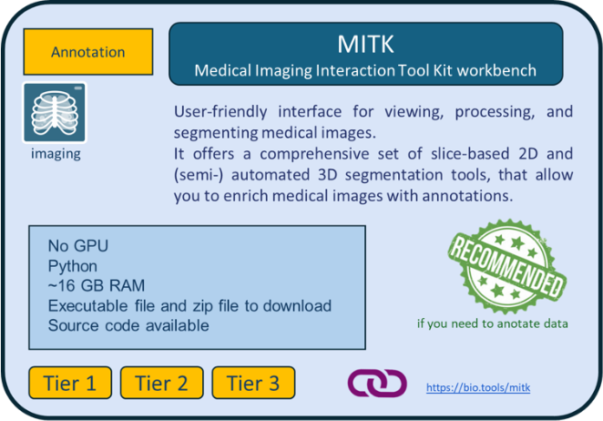                       | 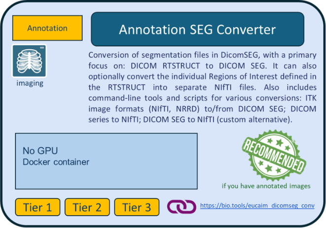 |
| 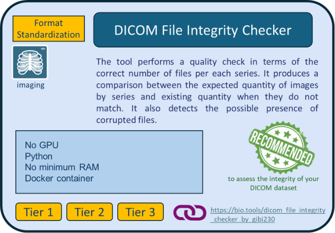 | 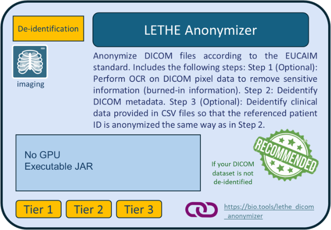 |
| 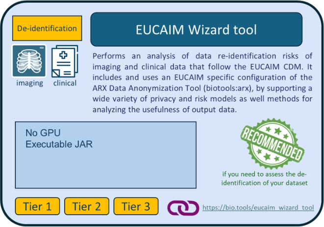   | 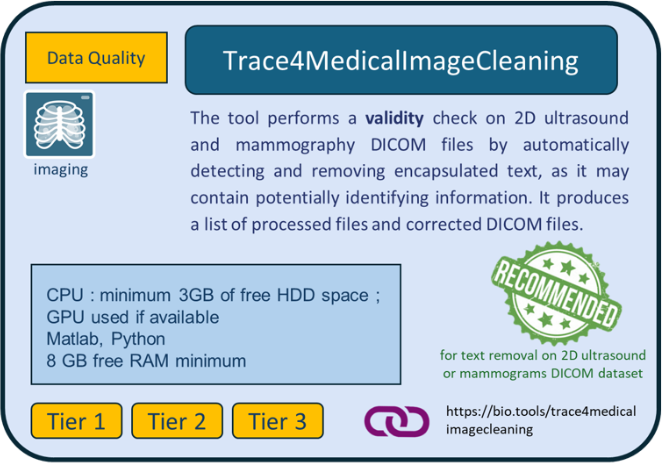 |
| 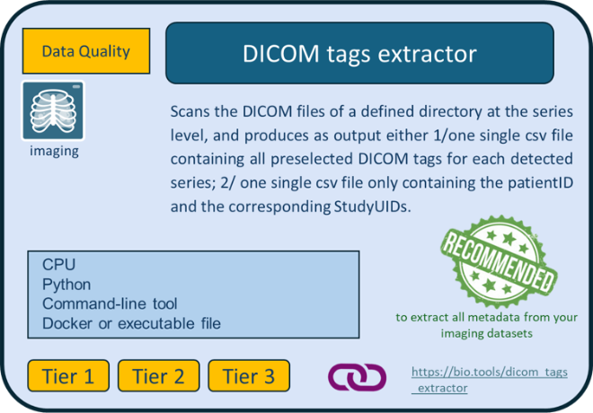       | 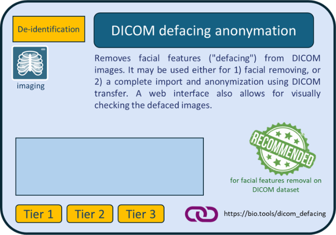 | 
| 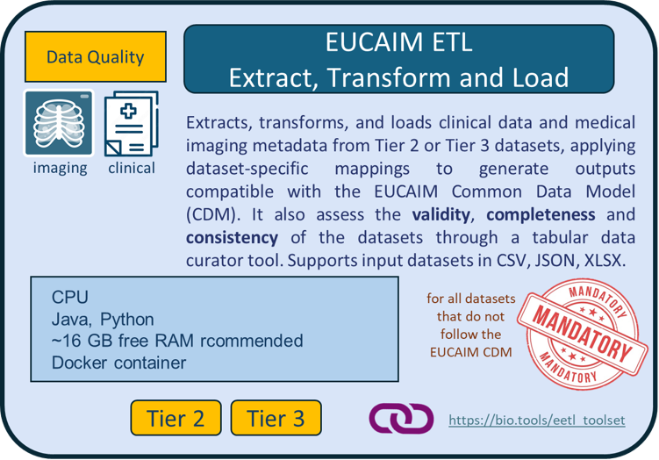 |  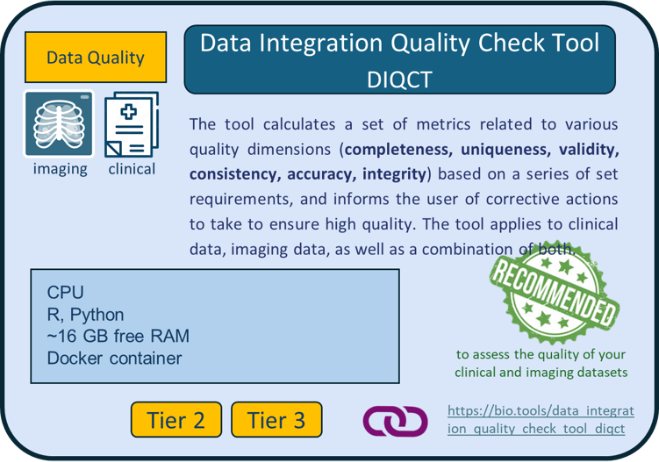|
| 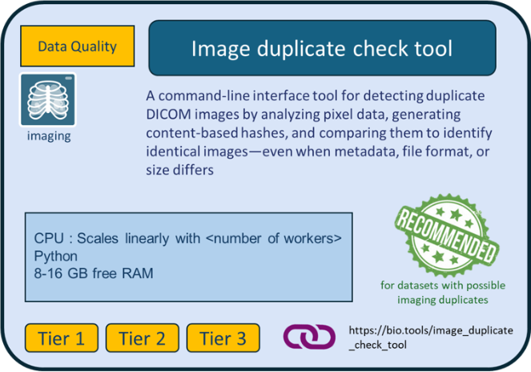 |  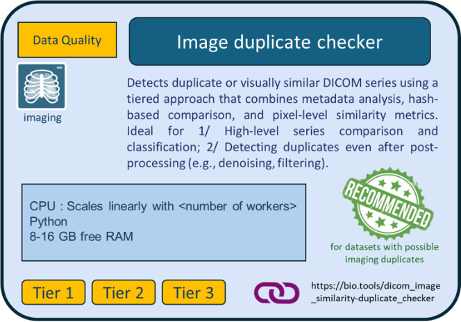|

[<u>Figure
7</u>](https://eucaim.gitbook.io/handbook/datapreparation#figur_datatools):
EUCAIM data preparation tools for data holders. Click on the thumbnail
for more information about the tool.

Instructions on the downloading and usage of each tool are given in the
links provided in the description of the tools in the bio.tools
catalogue.

Data holders can get information about the data preparation tools
(listed in the following subsections) in the bio tools catalogue
([<u>https://bio.tools/t?domain=eucaim</u>](https://bio.tools/t?domain=eucaim)).
The binaries of the tools can be downloaded from:

- the EUCAIM Software artifacts registry, the EUCAIM harbor

- the EUCAIM drive repository

#### Access to the EUCAIM Software artifacts registry (Harbor)

([<u>https://harbor.eucaim.cancerimage.eu/harbor/projects/3/repositories</u>](https://harbor.eucaim.cancerimage.eu/harbor/projects/3/repositories))

The access to the registry requires a valid account and additional
permissions that can be requested on the first access to the registry. Instructions on how to request access and download tools are available [<u>here
</u>](https://drive.eucaim.cancerimage.eu/s/pxpTJWSTFsLbqPQ?dir=/&editing=false&openfile=true)\.

It is advisable that once data holders request access to the registry, they open a ticket in the EUCAIM
helpdesk  - in the enrollment group - to speed up the process of approval
(only data holders and project members can download the tools).
Below is a step-by-step guide on how to access
the Harbor repository and download the required tools.

#### Access to the EUCAIM drive repository

([<u>https://drive.eucaim.cancerimage.eu/apps/files/files/1520?dir=/Applications</u>](https://drive.eucaim.cancerimage.eu/apps/files/files/1520?dir=/Applications))

## **Tier 1 datasets**

### **Steps to prepare your Tier 1 dataset for transfer to a reference node**

The preparation of your dataset will follow four steps – image
annotation (optional), de-identification, data quality check, and data
transfer – as described below:

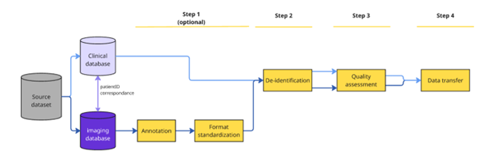

**Figure 8**: Step-wise preparation of Tier 1 dataset
to be transferred to a reference node.

#### **Step 1: Image annotation (optional)**

You may want to annotate your imaging data to enrich the quality of your
dataset.

Tools: We recommend using the [**<u>MITK
(Medical Imaging Interaction Toolkit)
Workbench</u>**](https://bio.tools/mitk), which ensures the output
format will be in the required format to be compliant with EUCAIM. Using
it would avoid the burden (and the risk) of additional conversion
procedures. Data can be also annotated using the DICOM Viewers from
reference node environments after transferring the data.

**Format standardization (optional)**: it is recommended that your
imaging raw data are in DICOM format, and that your annotations are in
DICOM-SEG.\
Tools: If you have existing annotation files
that are not in DICOM-SEG, you may use the EUCAIM [**<u>Annotation Seg
converter</u>**](https://hub.docker.com/r/mariov687/dicomseg) tool to
convert them.

#### **Step 2: De-identification**

You must ensure that no identifiable information (direct or indirect) is
present in the dataset you will share (Figure 9).

***Important points to consider before
de-identification***

If your Tier 1 dataset is not originally anonymized we recommend
preparing a tabular file associating StudyUIDs from DICOM images with
corresponding clinical “episode” and “timepoint events”, in case the
dataset contains multiple episode/timepoints.

Tools: This can be done using the [**<u>DICOM
tags extractor</u>**](https://bio.tools/dicom_tags_extractor) tool
(Figure 7). For more information, see further below section
[<u>5.3.3.2</u>](#bookmark=id.e3irrt7bxs08) Step 2 on imaging data
preparation.

If your imaging data are not already de-identified, you may use the
[**<u>Lethe EUCAIM
Anonymizer</u>**](https://harbor.eucaim.cancerimage.eu/harbor/projects/3/repositories/lethe-dicom-anonymizer/)
(Figure 7). In this case, you must ensure the following:

- the patient ID linking clinical and imaging data must be identical and
  listed as the first variable in the clinical dataset for tabular data;

- your raw imaging data are in DICOM format;

- the tool requires as input the SITE_ID, the unique identifier of the
  data provider, which you can see in your user profile from the
  [<u>EUCAIM Dashboard</u>](https://dashboard.eucaim.cancerimage.eu/)
  (<u>[Figure](https://eucaim.gitbook.io/handbook/datapreparation#fig_dataanon)</u>
  9). In case your Life Science account is not
  assigned to a known organization, then this will be empty and so you
  can create a ticket in the Helpdesk to request one;

Special attention must be given to **embedded text** in images, which
may contain patient-identifiable information, as well as **craniofacial
images** that pose a risk of patient re-identification. You may need to
apply additional de-identification techniques to mitigate this risk.\
Tools: Tools such as the [**<u>DICOM defacing
anonymisation</u>**](https://bio.tools/dicom_defacing_anonymation) tool
from the EUCAIM catalogue (Figure 7) may be used to remove facial
features from your DICOM images. For 2D ultrasounds and mammography
**dataset**, you may use the [**<u>Trace4MedicalImage
cleaning</u>**](https://bio.tools/trace4medicalimagecleaning) tool, that
detects and removes encapsulated text in DICOM files. [<u>The Lethe
EUCAIM
Anonymizer</u>](https://harbor.eucaim.cancerimage.eu/harbor/projects/3/repositories/lethe-dicom-anonymizer)
tool also provides options to remove burned-in PHI pixel data from the
images.

**Re-identification risk assessment (optional)**: Even if no automatic
re-identification risk analysis on a combination of clinical and imaging
metadata is possible at this Tier, you should carefully assess that no
direct or indirect identifiers are present in your data.\
Tools: For assessing the risk of
re-identification of patients based on your **imaging metadata** before
sharing your dataset, you may use the [<u>EUCAIM</u> **<u>Wizard
tool</u>**](https://bio.tools/eucaim_wizard_tool). Extraction of imaging
metadata to feed the wizard tool is possible by using the [**<u>DICOM
tags extractor</u>**](https://bio.tools/dicom_tags_extractor) tool
(Figure
[<u>7</u>](https://eucaim.gitbook.io/handbook/datapreparation#fig_dataanon)).
You may also use the [<u>ARX Anonymization
Tool</u>](https://bio.tools/arx) to assess the re-identification risk of
your clinical metadata, but it requires the specification of the
quasi-identifier attributes by the DH. In addition, the creation of
generalization hierarchies is necessary if you want to perform a
utility–risk trade-off analysis and apply appropriate risk-mitigation
strategies.

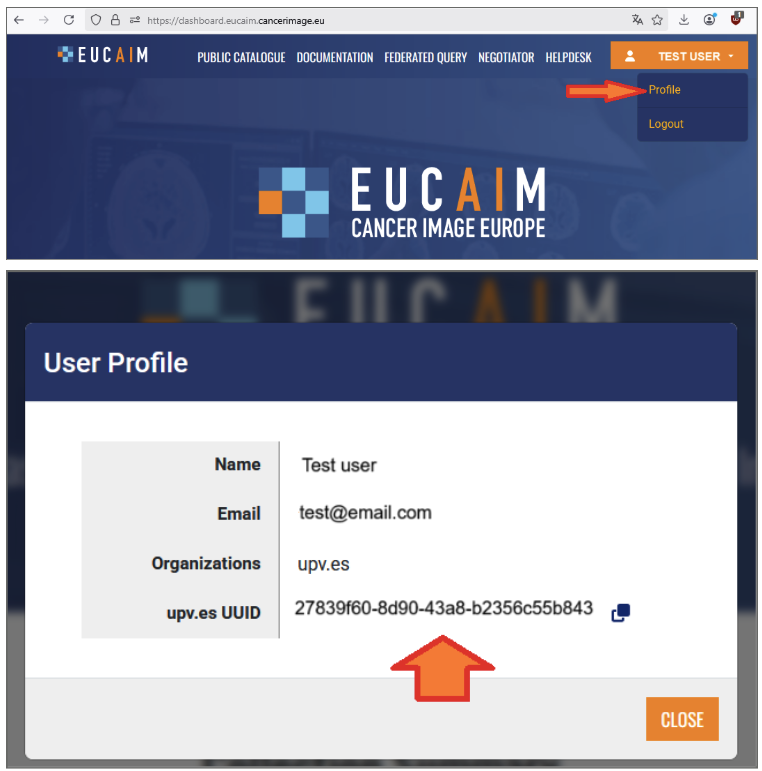

> **Figure 9: Retrieving SITE ID from the Dashboard.**

#### **Step 3: Data quality check**

**As per the EUCAIM data quality framework, you must ensure that your
dataset is**:

- **Complete**: all required data values are present.

- **Unique**: no entity exists more than once within the dataset.

- **Consistent**: values across attributes, records, files and
  timepoints, comply with predefined logical and temporal rules.

- **Accurate**: correspondence between dataset values to real values.

- **Showing integrity**: absence of data value loss or corruption.

You may use dedicated tools to assess the degree of compliance of your
dataset to these principles.

Tools: Some tools from the EUCAIM catalogue
can help you to assess the degree of compliance of your dataset to each
EUCAIM DQ dimension:

- the **accuracy** and **integrity** of your imaging dataset may be
  assessed using the [**<u>DICOM File integrity
  checker</u>**](https://bio.tools/dicom_file_integrity_checker_by_gibi230).

- **Uniqueness** can be addressed with two EUCAIM tools that search for
  image duplicates: the [**<u>Image duplicates
  checker</u>**](https://bio.tools/dicom_image_similarity-duplicate_checker),
  capable of detecting duplicate or visually similar DICOM series by
  combining metadata analysis, hash-based comparison, and pixel-level
  similarity metrics; the [**<u>Image duplicate check
  tool</u>**](https://bio.tools/image_duplicate_check_tool), that
  detects duplicate DICOM images by analyzing pixel data.

#### **Step 4: Data transfer** 

Tier 1 datasets can either be transferred to a reference node, or remain
at your site. If your dataset remains on site, any
data users interested in your dataset (as per the information
found in the EUCAIM catalogue) will be put in direct contact with you.
If you wish to transfer your dataset to a reference node, please refer
to Section 6 of the Handbook for further information.

## **Tiers 2 & 3 datasets**

### **EUCAIM Common Data Model and Hyperontology**

The [**<u>EUCAIM Common Data
Model</u>**](https://eucaim.gitbook.io/eucaim-common-data-model/1.-introduction)
defines a standardized structure for representing clinical and imaging
metadata across the EUCAIM platform. It ensures that data contributed by
different partners can be understood and used in a consistent way.

**Key features:**

- It is based on the conceptual model of [<u>mCode
  specification</u>](https://ascopubs.org/doi/10.1200/CCI.20.00059)

- The current version of the EUCAIM CDM Data Dictionary is available
  [<u>here</u>](https://docs.google.com/spreadsheets/d/1ox9PdvfCDxpDmEnFzC1M6OFhUhXpjQzg/edit?usp=sharing&ouid=115998150174651530097&rtpof=true&sd=true).

- Supports multimodal data (i.e. imaging and clinical).

- Facilitates efficient querying, tool compatibility, and federated
  analysis and learning.

The [**<u>EUCAIM</u>**
**<u>hyperontology</u>**](https://hyperontology.eucaim.cancerimage.eu/)
is a common semantic meta-model that supports and maintains semantic
interoperability and ensures consistent mapping and harmonization with
the EUCAIM CDM entities (tables and attributes). It provides rich
context, making it easier for users and tools to interpret, search, and
reason over the data. In addition, the EUCAIM Hyperontology connects the
CDM’s data fields to standardized biomedical concepts (i.e.
terminology-binding) to verify that the data elements represented in the
EUCAIM CDM are semantically aligned with the knowledge (concepts and
object/data properties) described in the hyper-ontology. This ensures a
coherent interpretation and understanding of data between the
hyper-ontology and CDM.

**Why it is important:**

As a data holder, understanding the CDM and hyperontology is essential
for:

- **Mapping your data correctly**: Ensuring your local dataset aligns
  with EUCAIM standards.

- **Using tools effectively**: Tools in the EUCAIM ecosystem rely on the
  CDM to operate correctly.

- **Supporting reproducibility and scalability**: Harmonized data makes
  it easier to run federated analysis and integrate new tools.

### **Steps to prepare your Tier 2 or Tier 3 dataset to follow the EUCAIM CDM**

The preparation of your dataset will follow the 7 steps as described
above:

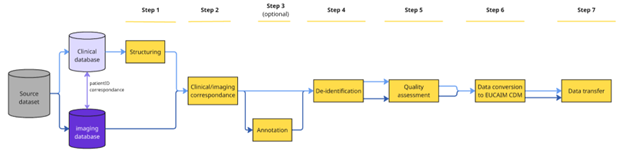

#### **Step 1: Clinical data structuring**

In order to have interoperable data that can be queried and processed,
we need you to provide us with information on your dataset structure
using another tabular template file
([<u>EUCAIM_example_file_patients_datasets_CDM_v6</u>](https://docs.google.com/spreadsheets/d/1zAReu8-40cAdH8Z7jH3kaHyYkrCILd2X/edit?usp=drive_link&ouid=105979482259582415027&rtpof=true&sd=true))
*in addition to* your source dataset.

- **How the tabular template file is organized:**

  - The "Data elements" tab lists the entities and their corresponding
    data elements for clinical variables, with definition and data type;

  - The other 3 tabs show an example of how to structure your datasets
    of positive or diagnostic cases (for negative screening and control
    groups, please refer to the corresponding template file);

    - the "Overarching Episode" corresponds to the entire course of the
      patient’s data collection (example: from diagnosis to death or
      last contact). All diagnosis information should be in there;

    - each episode recorded in your dataset must be separated from the
      first tab in another tab in chronological order (example :
      “Treatment 1”, “Progression”, “Treatment 2”, “Remission”,
      “Relapse”, “Treatment 3”, “Active Surveillance").

In each tab :

- Line 1 contains the names of the variables as they are defined in your
  own dataset

- On line 2 are the name of the corresponding entity in the EUCAIM CDM,
  as shown in the "Data elements" tab

- On line 3 are the name of the corresponding data element name in the
  EUCAIM CDM, as shown in the "Data elements" tab

- On line 4 is the standard used in the dataset

- On line 5 is an example of value

<!-- -->

- **How to structure your dataset**

Your clinical dataset must be structured as a **tabular file**, either
xls format, or csv format. As per the ETL requirements, **csv** files
must use a full stop “.” as decimal separator, and we also recommend
using comma “,” as list separator. If other characters are used
(semi-colon, tabs, etc), it should be communicated in advance to the ETL
support team.

For datasets with multiple timepoints, we recommend “vertical” datasets,
meaning that your dataset has one row per timepoint.

Please give your dataset file a name with the **dataset_ID as first
character**.

Example : “Dataset_ID_colon_study_2022.xls”

If you have several datasets, please make sure to store them in separate
locations.

- **How to complete the template file**

<u>Notes before you start</u>: 1/ You may create your own tabular file
or use this example file if useful. 2/ The example datasets in this file
only contain the mandatory variables; you should provide the full list
of variables available in your dataset.

1.  We recommend that the name of the template file also contains the
    dataset_ID as the first character.

2.  Please make sure it contains the *exact* variables' names on the
    first row (matching the variable’s names from your source dataset),
    and the PatientID as the first variable.

3.  Separate all episodes into different tabs as described above, except
    for Diagnosis that belongs to the Overarching episode.

Note: episodes may correspond to the following: Treatment, Progression,
Relapse, Remission, Active Surveillance.

4.  For each variable of your dataset, find the corresponding entity and
    data element name (see data element tab), and add both under the
    variable name on line 2 and 3, respectively. Important: for several
    entities, the Code attribute must be accompanied by the Category
    attribute.

Example 1 with “Imaging acquisition” as Procedure: we need to specify
the sequence (CT, MRI) as “Code”, and assign to it “imaging” as
Category. See in the Overarching episode tab on this dataset example,
columns M-N. Note that the name of the variable is then merged on both
columns.

Example 2 with “Smoking Status” as Medical History: we need to specify
the status value itself (smoker, non-smoker, etc) as “Code”, and assign
to it “Observation” as Category. See in the Overarching episode tab on
this dataset example, columns Q-R. Again, the name of the variable must
be merged on both columns."

5.  For each variable of your dataset, please provide an example value
    on line 5 (add the value as it is spelled exactly in your dataset)

6.  For each variable of your dataset:

- if the variable follows strictly a specific standard, please provide
  the name of the standard on line 4

Example: in the Overarching episode tab, column K, the “Histological
type” variable strictly follows the SNOMEDCT standard; line 4 specifies
“SNOMEDCT”, and an example value is provided on line 5.\
Important: both information must be separated by a comma, without space

- if the variable follows specific standard with in-house coding or
  remaining, please provide the name of the standard on line 4, and
  provide the correspondence between all possible values from your
  dataset and the standard values on lines 6 and onwards

Example 1 in the Overarching episode tab: column I, the "Tumor site:
Region" variable follows the SNOMEDCT standard using an in-house coding;
line 4 specifies "SNOMEDCT", an example value is provided on line 5, and
correspondence for all possible values present in the dataset to the
SNOMEDCT codes is listed on lines 6-9, separated by a comma.

Example 2 in the Overarching episode tab: column L, the "Histological
subtype" variable follows the SNOMEDCT standard using an in-house
naming; line 4 specifies "SNOMEDCT", an example value is provided on
line 5, and correspondence for all possible values present in the
dataset to the SNOMEDCT codes is listed in lines 6-9, separated by a
comma.

- if the variable does not follow a specific standard, please state
  "custom" on line 4, and provide the list of all possible values from
  your dataset for that variable on lines 6 and onwards

Example in the Overarching episode tab : column J, the "Tumor Site :
Laterality" variable does not follow a standard, but only uses the label
"Left" or "Right"; in that case line 4 specifies "custom", an example
value is provided on line 5, and all possible values present in the
dataset (here "Left" and "Right" is listed on lines 6-7.

#### **Step 2: Imaging correspondence with clinical data**

First and foremost, you need to make sure that your imaging raw data are
in DICOM format, and if applicable, that your annotations are in
DICOM-SEG.

In order to successfully link the imaging exams from your dataset with
the clinical information you provide, especially the timepoints of each
episode, we need to retrieve the correspondence between each imaging
study and each clinical episode.

***Before de-identification of your dataset\****, please create a
tabular csv file that contains the following information:

- **PatientID** - the exact one from your DICOM images (attribute
  (0010,0020))

- **StudyUID** - the exact one from your DICOM images (attribute
  (0020,000D))

\*<u>Note : if your dataset is already anonymized</u>, you can still use
the DICOM tags extraction tool to provide the file, proceed with step 2
and skip step 3. It is important that you can still link the
(anonymized) PatientID with the episodes and timepoints.

Tools: To assist you retrieving all PatientID
and StudyUID from your imaging dataset, you may use the [**<u>DICOM tags
extractor tool</u>**](https://bio.tools/dicom_tags_extractor) and its
“dicom_tags_selection” script. A template csv input file called
“imaging_studies_episodes.csv”, provided with the tool, allows to
retrieve the following attributes from your imaging dataset (cf tool
documentation): PatientID, StudyUID, StudyDate, Study description (Table
4).

<table style="width:94%;">
<colgroup>
<col style="width: 18%" />
<col style="width: 30%" />
<col style="width: 18%" />
<col style="width: 26%" />
</colgroup>
<thead>
<tr>
<th style="text-align: left;"><strong>PatientID
(0010,0020)</strong></th>
<th style="text-align: left;">
<strong>StudyUID</strong>

<strong>(0020,000D)</strong>
</th>
<th style="text-align: left;"><strong>StudyDate
(0008,0020)</strong></th>
<th style="text-align: left;"><strong>StudyDescription
(0008,1030)</strong></th>
</tr>
<tr>
<th style="text-align: left;">ABC-000103</th>
<th style="text-align: left;">1.2.824.0.2.3886579.08.383.1010.6135</th>
<th style="text-align: left;">2018-12-11</th>
<th style="text-align: left;">Whole Body I-131 CT</th>
</tr>
<tr>
<th style="text-align: left;">ABC-000103</th>
<th style="text-align: left;">1.2.824.0.2.4653289.08.563.1010.4679</th>
<th style="text-align: left;">2018-12-23</th>
<th style="text-align: left;">Screening-Bilateral Mammography</th>
</tr>
<tr>
<th style="text-align: left;">ABC-000103</th>
<th style="text-align: left;">1.2.824.0.2.06135249.08.647.2304.7961</th>
<th style="text-align: left;">2019-01-13</th>
<th style="text-align: left;">I131 high dose</th>
</tr>
<tr>
<th style="text-align: left;">ABC-000107</th>
<th style="text-align: left;">1.2.824.0.2.4862015.07.383.5623.6820</th>
<th style="text-align: left;">2017-05-17</th>
<th style="text-align: left;">Bilat Mammography</th>
</tr>
</thead>
<tbody>
</tbody>
</table>

**Table 4: Example output file of the dicom_tags_selection script.** The
StudyDate, and StudyDescription in Study are provided for indication
only, to guide you for the mapping of each study to each episode (see
step 2).

You then need to edit the output file by adding the “Episode” and
“Timepoint” information for each study (i.e each row) as below:

- **Episode** - The episode information has to match the name of the
  episode provided in the clinical template file. As per the EUCAIM CDM,
  possible values are: Diagnosis, Treatment, Progression, Relapse,
  Remission, Active Surveillance.

- **Timepoint** - As there can be multiple imaging procedures per
  episode, please number all studies in ascending order (1, 2, 3,…).
  Note : the numbering only concerns imaging procedures, not any other
  procedure in between.

<table style="width:96%;">
<colgroup>
<col style="width: 12%" />
<col style="width: 30%" />
<col style="width: 13%" />
<col style="width: 18%" />
<col style="width: 9%" />
<col style="width: 11%" />
</colgroup>
<thead>
<tr>
<th style="text-align: left;"><strong>PatientID
(0010,0020)</strong></th>
<th style="text-align: left;">
<strong>StudyUID</strong>

<strong>(0020,000D)</strong>
</th>
<th style="text-align: left;"><strong>StudyDate
(0008,0020)</strong></th>
<th style="text-align: left;"><strong>StudyDescription
(0008,1030)</strong></th>
<th style="text-align: left;"><strong>Episode</strong></th>
<th style="text-align: left;"><strong>Imaging Timepoint</strong></th>
</tr>
<tr>
<th style="text-align: left;">ABC-000103</th>
<th style="text-align: left;">1.2.824.0.2.3886579.08.383.1010.6135</th>
<th style="text-align: left;">2018-12-11</th>
<th style="text-align: left;">Whole Body I-131 CT</th>
<th style="text-align: left;">Diagnosis</th>
<th style="text-align: left;">1</th>
</tr>
<tr>
<th style="text-align: left;">ABC-000103</th>
<th style="text-align: left;">1.2.824.0.2.4653289.08.563.1010.4679</th>
<th style="text-align: left;">2018-12-23</th>
<th style="text-align: left;">Screening-Bilateral Mammography</th>
<th style="text-align: left;">Diagnosis</th>
<th style="text-align: left;">2</th>
</tr>
<tr>
<th style="text-align: left;">ABC-000103</th>
<th style="text-align: left;">1.2.824.0.2.06135249.08.647.2304.7961</th>
<th style="text-align: left;">2019-01-13</th>
<th style="text-align: left;">I131 high dose</th>
<th style="text-align: left;">Treatment</th>
<th style="text-align: left;">3</th>
</tr>
<tr>
<th style="text-align: left;">ABC-000107</th>
<th style="text-align: left;">1.2.824.0.2.4862015.07.383.5623.6820</th>
<th style="text-align: left;">2017-05-17</th>
<th style="text-align: left;">Bilat Mammography</th>
<th style="text-align: left;">Diagnosis</th>
<th style="text-align: left;">1</th>
</tr>
</thead>
<tbody>
</tbody>
</table>

**Table 5: Example of edited file with correspondence between StudyUID
and both Episode and Timepoint.** The part in blue corresponds to the
part edited manually by the data holder.

#### **Step 3: image annotation (optional)**

You may want to annotate your imaging data to enrich your dataset. We
recommend using the [**<u>MITK (Medical Imaging Interaction Toolkit)
Workbench</u>**](https://bio.tools/mitk) that ensures the output format
will be in the required format to be compliant with EUCAIM. Using it
would avoid the burden (and the risk) of additional conversion
procedures. Data can be also annotated using the DICOM Viewers from
reference nodes environments after transferring the data (Step 7).

Your imaging raw data must be in DICOM and your annotations in DICOM-SEG
format. If you have existing annotation files that are not in DICOM-SEG,
you may use the EUCAIM [**<u>Annotation Seg
converter</u>**](https://hub.docker.com/r/mariov687/dicomseg) tool to
convert them.

#### **Step 4: De-identification**

You must ensure that no identifiable information (direct or indirect) is
present in the dataset you will share (**Figure 9**).

The official tool for de-identification in EUCAIM is [**<u>Lethe EUCAIM
Anonymizer</u>**](https://harbor.eucaim.cancerimage.eu/harbor/projects/3/repositories/lethe-dicom-anonymizer/). This tool ensures the specific PatientID code system. 
Even if you are already anonymizing data using your own methods, we strongly recommend using the EUCAIM tool. The main reasons are:
- **Unique Patient ID Generation**: Lethe Anonymizer automatically assigns a hashed PatientID to each patient. This 32mechanism ensures that the PatientID remains unique across the entire EUCAIM ecosystem, preventing any ID collisions between different DHs. This hash is generated using two components: 
  - The original Patient ID.
  - The specific SiteID of the Data Holder.
- **How to obtain your SiteID**: The SiteID is a required input for Lethe and can be retrieved from your User Profile in the EUCAIM Dashboard (UUID). To access this, you must log in with your institutional account, which must be properly registered in LS-AAI. You have to coordinate with your local IT department to ensure your institution is correctly integrated into the LS-AAI system. Google accounts or similar can’t be used to retrieve this SiteID.
- **Synchronizing Clinical Data**. To ensure your clinical data matches the hashed PatientIDs generated for the DICOM images, you can provide a CSV file during the anonymization process. The only requirement is that the first column must be the original PatientID. Lethe will then output: 
  - The anonymized DICOM images.
  - A modified CSV file where the original IDs are replaced by the new hashed IDs.”

([<u>Figure
7</u>](https://eucaim.gitbook.io/handbook/datapreparation#bookmark=kix.br72yai62sd4)). The use of [**<u>Lethe EUCAIM
Anonymizer</u>**](https://harbor.eucaim.cancerimage.eu/harbor/projects/3/repositories/lethe-dicom-anonymizer/) requires:

- The patient ID linking clinical and imaging data must be identical and
  listed as the first variable in the clinical dataset for tabular data;

- Your raw imaging data are in DICOM format;

- The tool requires as input the SITE_ID
  (**<u>[Figure](https://eucaim.gitbook.io/handbook/datapreparation#fig_dataanon)</u>
  9**), the unique identifier of the data provider, which is you can see
  in your user profile from the [<u>EUCAIM
  Dashboard</u>](https://dashboard.eucaim.cancerimage.eu/). In case your
  Life Science account is not assigned to a known organization, then
  this will be empty and so you can create a ticket in the Helpdesk to
  request one;

Special attention should be given to **embedded text** in images, that
may contain patient-identifiable information, as well as **skull and
head images** that pose a risk of patient re-identification. You may
need to apply additional de-identification techniques to mitigate this
risk.\
Tools: Tools such as the [**<u>DICOM defacing
anonymisation</u>**](https://bio.tools/dicom_defacing_anonymation) tool
from the EUCAIM catalogue (Figure 7) may be used to remove facial
features from your DICOM images. For 2D ultrasounds and mammography
**dataset**, you may use the [**<u>Trace4MedicalImage
cleaning</u>**](https://bio.tools/trace4medicalimagecleaning) tool, that
detects and removes encapsulated text in DICOM files. [<u>The Lethe
EUCAIM
Anonymizer</u>](https://harbor.eucaim.cancerimage.eu/harbor/projects/3/repositories/lethe-dicom-anonymizer)
tool also provides options to remove burned-in PHI pixel data from the
images.

**Re-identification risk assessment for imaging and clinical data
(optional)**: Before sharing your dataset, you should carefully assess
that no direct or indirect identifiers are present in your data.\
Tools: Extraction of imaging metadata to feed
the wizard tool is possible by using the [**<u>DICOM tags
extractor</u>**](https://bio.tools/dicom_tags_extractor) tool (Figure
[<u>7</u>](https://eucaim.gitbook.io/handbook/datapreparation#fig_dataanon)).
Based on the EUCAIM CDM structure, ready-to-use hierarchies can be
imported in the [<u>EUCAIM</u> **<u>Wizard
tool</u>**](https://bio.tools/eucaim_wizard_tool) to initiate an
analysis that is specifically tailored to the vocabulary and
classification used in EUCAIM clinical metadata as well. The process and
rationale is identical to the imaging metadata risk analysis, but the
overall risk for re-identification concerning a patient with clinical
and imaging info cannot be accurately quantified from the two
independent analyses. However, the deployment of two discrete steps of
optimizing the available information for security and usability for
clinical and imaging information independently will work cumulatively
for the overall data value.

You must ensure that no identifiable information (direct or indirect) is
present in the dataset you will share (Figure 9).

#### **Step 5: Data quality assessment**

**As per the EUCAIM data quality framework, you must ensure that your
dataset is**:

- **Complete**: all required data values are present

- **Unique**: no entity exists more than once within the dataset

- **Consistent**: dataset values of two sets of attributes within a
  record / within a data file / between data files / within a record at
  different points in time, comply with a rule

- **Accurate**: correspondence between dataset values to real values

- **Showing integrity**: absence of data value loss or corruption

Tools: You may use dedicated tools to assess
the degree of compliance of your dataset to these principles. Some tools
from the EUCAIM catalogue can help you to do so:

- The [**<u>DICOM File integrity
  checker</u>**](https://bio.tools/dicom_file_integrity_checker_by_gibi230)
  can check the **accuracy** and **integrity** of your imaging dataset.

- For 2D ultrasounds and/or mammography **datasets,** **validity**
  assessment is possible using the [**<u>Trace4MedicalImage
  cleaning</u>**](https://bio.tools/trace4medicalimagecleaning) tool,
  that detects and removes encapsulated text in DICOM files.

- **Uniqueness** can be addressed with two EUCAIM tools that search for
  image duplicates: the [**<u>Image duplicates
  checker</u>**](https://bio.tools/dicom_image_similarity-duplicate_checker),
  capable of detecting duplicate or visually similar DICOM series by
  that combining metadata analysis, hash-based comparison, and
  pixel-level similarity metrics; the [**<u>Image duplicate check
  tool</u>**](https://bio.tools/image_duplicate_check_tool), that
  detects duplicate DICOM images by analyzing pixel data.

- The
  [**<u>DIQCT</u>**](https://bio.tools/data_integration_quality_check_tool_diqct)
  may help you assess various aspects of your dataset’s quality, both
  for imaging and clinical data, such as its **completeness, uniqueness,
  validity, consistency, integrity.**

> ·

#### **Step 6: Data conversion to EUCAIM Common Data Model**

Transformation of the clinical and imaging datasets in accordance with
the EUCAIM CDM is recommended for Tier 2 nodes and mandatory for Tier 3
nodes. Tier 2 nodes can opt instead to implement a custom mapping
component to interact with the federated search service. The
transformation step requires:

a\) the mapping between the source metadata (clinical and imaging) and
the EUCAIM CDM.

b\) the actual transformation of all the clinical and imaging data to a
format compliant with the EUCAIM CDM through the use of the [**<u>EUCAIM
ETL</u>**](https://bio.tools/eetl_toolset).

For your imaging dataset:

> \- Fill in a tabular csv file with the correspondence between all the
> possible values of SeriesDescription to the EUCAIM CDM standard
> vocabulary entries (Table 6). For all the SeriesDescription that you
> cannot map, keep the original values. They will serve to enrich the
> EUCAIM CDM.
>
> \- Extract in a tabular csv file all the 75 mandatory attributes (list
> available here:
> <https://docs.google.com/document/d/1mnTkf2fvERgaRyQPDFebZHLwB8aBRaIZRkwlMBr3ZXQ/edit?tab=t.0>)
> present in your dataset. You may already have such file, especially if
> you used the Wizard tool on step 3 “de-identification” for
> re-identification risk assessment of imaging data. If not, you may use
> the **DICOM_tags_extractor** tool now**.**
>
> Finally, share the **two above-mentioned csv files** as well as the
> **file from step 2 on PatientID/StudyUID correspondence** with the ETL
> ingestion support team through the [<u>EUCAIM
> helpdesk</u>](https://help.cancerimage.eu/).

| **Source series Description**         | **EUCAIM series description** |
|---------------------------------------|-------------------------------|
| AXIALT2TSE                            | T2 weighted                   |
| axdifb1000                            | Diffusion weighted            |
| e-THRIVE_BHPERFU                      | PW                            |
| EP2D_DIFF_TRA_B50-1000_TRACEW_DFC_MIX | Diffusion weighted            |
| t2_tse_tra_p2_384ESTRICTO             | T2 weighted                   |

**Table 6: Example of correspondence between the Series Description from
the source images and the Series Description from the EUCAIM standard.**
The part in blue corresponds to the part edited manually by the data
holder. See
[**<u>here</u>**](https://docs.google.com/document/d/1mnTkf2fvERgaRyQPDFebZHLwB8aBRaIZRkwlMBr3ZXQ/edit?tab=t.0)
for the list of all possible SeriesDescription currently known in the
EUCAIM vocabulary.

#### **Step 7: Data transfer (optional)**

\- If you plan on transferring your dataset to a reference node, next
action would be to now proceed with the transfer (QP Insight for the UPV
node, XNAT for the Health-RI node). All the next steps will occur
directly on the node.

\- If you aim at storing your dataset in a federated node, make sure it
is stored in its final destination, and proceed with the next steps.

> **The ETL support team will proceed with you with the mapping to
> EUCAIM CDM at your site.**
>
> **Re-identification risk assessment (optional)**: you may want to
> verify that no direct or indirect identifiers are present in your
> clinical data. You may apply the Wizard tool to your clinical data
> file now that it is mapped to the EUCAIM CDM.

## **Metadata registration in the public catalogue (mandatory)**

**I**n parallel to dataset preparation, the associated metadata must be
registered to the EUCAIM public catalogue. This can be done at any stage
of dataset preparation, although we recommend doing it once the total
number of cases is final (e.g. after the data quality check). Table 5
below describes the steps to register your metadata.

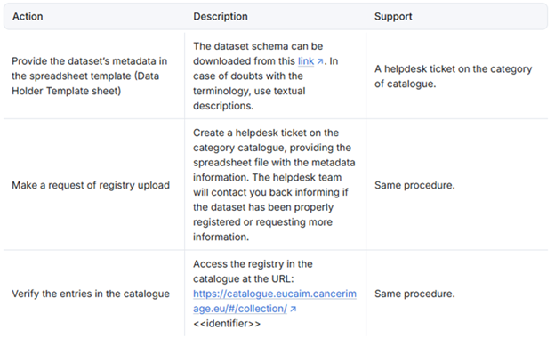

**Table 7**: Steps to submit the Metadata to the registry.
