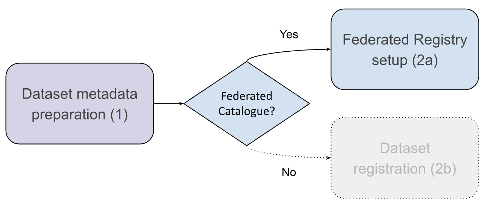

# 7\. Option 2: Setting up a Federated Node  {#7.-option-2:-setting-up-a-federated-node}

This section describes the requirements and process of setting up a node, including the security and privacy considerations and the expected Service Level Agreement. It describes the requirements and setps to achieve Tier 1 to Tier 3 compliance. Additionally, [section 7.5]({#7.5.-setting-up-a-local-node-with-mini-node}) describes the EUCAIM mini-node Software package, which provides an open-source solution for setting up a minimal node, capable of reachin Tier-2 compliance at the level of the services and Tier-3 compliance at the level of the data. Data Holders that have not set up their own node could find in this package a helpful software stack to deploy their own nodes.


## 7.1. Setting up the node {#7.1.-setting-up-the-node}

Data holders who opt to host the data locally must set up a local node capable of storing and processing the data extracted, anonymised and standardised. The requirements for the node depend on the amount of data to be processed. [Table 7](#tab_localnodespec2) and [Table 8](#tab_localnodespec3) show the minimum required expected for Tier 2 and Tier 3 node.

| Hardware | Minimum |
| :---- | :---- |
| CPU | 4 Cores /8 Threads |
| RAM | 32 GB  |
| Operating System Drive | 160+ GB SSD |
| Data Storage | 1x (Dataset size) Drives |

[Table 7](#table_localnodespec2): *Minimum hardware requirements for Tier 2 nodes.*

| Hardware | Minimum/Recommended |
| :---- | :---- |
| CPU | Minimum: 16 Cores \>=1.8GHZ or 12 Cores \>=3.0Ghz Recommended: 32 Cores /64 Threads 3.0Ghz |
| RAM | Minimum: 64GB Recommended: 128 GB ECC |
| Storage | Minimum: 1x(Dataset size)  Recommended: 2x(Dataset size) |
| GPU | Minimum: \>150 Tensor Cores 16GB VRAM |
| Motherboard | 4+ RAM Slot |

[Table 8](#table_localnodespec3)*: Minimum hardware requirements for Tier 3 nodes*

A detailed description on the needs and components required for the local node can be found in [D5.6](https://drive.google.com/file/d/1URY8jtofLQpokTh7Hzag2wFFV9r1d_fs/view?usp=sharing%20), section 3.7*.*

The processing capacity should be dimensioned to the amount of data available and it should be audited periodically.

### **7.1.1. Security and privacy considerations** {#7.1.1.-security-and-privacy-considerations}

As stated in section 3.2, The DH who set up a local node have to demonstrate that the site implements good practices related to security and privacy preservation. Although they are not mandatory, a certification such as  ISO/IEC 27001 and/or ISO/IEC 27701 would be appropriate to prove this capability. As a reference, the UPV reference node has a security and privacy document which is shared with the Data Holders in this link: [https://drive.google.com/file/d/1QK9pBuSwyMXNUdjIrNcd5khZb_Wpzmag/view?usp=drive_link](https://drive.google.com/file/d/1QK9pBuSwyMXNUdjIrNcd5khZb_Wpzmag/view?usp=drive_link). 

Ensure that the document includes the responsible persons and contacts in charge of the management of the site, the monitoring, backuping and security incidents. The site should implement periodic security audits. External security audits are also encouraged.

### **7.1.2. Service Level Agreement** {#7.1.2.-service-level-agreement}

The federated nodes have to guarantee that they commit enough resources to deal with the necessary level of service. This should be committed by signing a Service Level Agreement that declares the resources committed to the infrastructure, the Service support conditions, the committed Availability and Reliability and the contact points. As a basis, the UPV reference node has the Service Level Agreement publicly available in [https://eucaim-node.i3m.upv.es/dataset-service/web/sla.pdf](https://eucaim-node.i3m.upv.es/dataset-service/web/sla.pdf).   

## 7.2. Tier 1 compliance {#7.2.-tier-1-compliance}

The compliance at the Tier 1 level implies that the metadata of the datasets follow the  EUCAIM DCAT-AP specification. In this case, the data holder can decide to register the datasets directly on the EUCAIM public catalogue or to set up its own federated registry. At this moment in time, we recommend the former, as the harvester will be released soon. 

The registration of the dataset on the public catalogue has been described in section 5.1 / Table 4 of this document. The set up of a local catalogue is optional and it is described in [figure 10](#fig_tier1fednode) and [table 9](#tab_tier1fednode), and comprise the following actions:

- Dataset metadata preparation. This implies identifying the data to be shared and packaged into a dataset, the extraction of the metadata and the appropriate coding into the EUCAIM DCAT-AP terminology and vocabularies. This has been covered in section 5 of this document.

- Setup of a local instance of the catalogue. We recommend using Molgenis and the Catalogue application developed by ErasmusMC. Deployment can be done through a Docker container or a Kubernetes manifest.

- In the coming future, we will support the federation of datasets through a pull model in which datasets’ metadata is harvested by the central catalogue. This will require deploying a local registry and populating it with the information of the DH’s datasets.



<a id="fig_tier1fednode"></a>Figure 10: Workflow for the tier 1 compliance in a Federated node.

| Action | Purpose | Link |
| :---- | :---- | :---- |
| Set up of the local catalogue | Deployment of a local instance of the catalogue to populate it with the information of the datasets provided by the Data Holder | [Gitlab repository](https://gitlab.com/radiology/infrastructure/studies/eucaim/molgenis-emx2-eucaim) |
| Population of the data | Data should follow the EUCAIM interoperability schema. A sample file can be used to fill-in the information of the datasets and to create the schemas on the database. Detailed information is provided in [https://github.com/EUCAIM/End-User-Guide/blob/main/6-UserGuide4Members.md\#631-tier-1-compliance](https://github.com/EUCAIM/End-User-Guide/blob/main/6-UserGuide4Members.md#631-tier-1-compliance)  | [Sample file with the schema](https://docs.google.com/spreadsheets/d/19DDoFq-_Bj7wfEf5KjkISe13kS-W5EYQ/edit?usp=sharing&ouid=102741390744373897413&rtpof=true&sd=true). |
| Federation of the catalogue **(in progress)**  | Enable automatic synchronisation of the local catalogue with the central one. | In progress |

[Table 9](#table_tier1fednode): Set up a federated Catalogue

## 7.3. Tier 2 compliance {#7.3.-tier-2-compliance}

The Tier 2 compliance implies that the data that is hosted at the federated node can be searched according to the searching variables defined in the CDM. At this point it is assumed that:

- The Data Holder has set up a repository with the imaging and clinical data, in accordance with the data requirements outlined in Section 5.2   
- The repository has a searching endpoint that can be accessed to retrieve the number of subjects and studies that fulfil a specific filtering criteria.

The steps needed to integrate the local node are described in [figure 11](#fig_tier2fednode).

Figure 11: Actions to integrate a federated node in the tier 2 level.

The actions corresponding to the federated search are described in the gitbook ([https://eucaim.gitbook.io/enduserguide/6-userguide4members\#id-6.3.-contribution-through-a-federated-node](https://eucaim.gitbook.io/enduserguide/6-userguide4members#id-6.3.-contribution-through-a-federated-node)) .

The steps that need to be developed are the following:

| \# | Action | Documentation / Links |
| :---- | :---- | :---- |
| 1 | Metadata mapping | A mapping of the searchable items described in Tables 14 and 15 in D5.6 to the local variables should be defined. If the data is already transformed to the EUCAIM CDM (see Section 5.2), then this step is not required. |
| 2a | Mediator component deployment (recommended) | The deployment of the SQL-based mediator component can be done as a Docker container. Section 7.3.1 Describes the process (if you are using a [mini node](#7.5.-setting-up-a-local-node-with-mini-node), this will be performed automatically). |
| 2b | Mediator component development (optional) | If you are not exposing the data following the FHIR Standard or as a CDM-compliant PostresSQL (which is the result ), you should develop your own component to adapt the queries. An example of such component can be found in D5.6 “ Section 5.2.1 *Dataset in a Federated Node*, subsection “Guidelines for creating a mapping component”. |
| 3 | Request registration in the explorer | Once the components are deployed, a ticket in the helpdesk, under the category “federated search” should be created with the request “register a new federated search provider”.  |

Once you have the component developed and deployed, the integration with the federated search central services requires several steps, which are detailed next. 

### **7.3.1. Node Registration and Deployment** {#7.3.1.-node-registration-and-deployment}

After submitting and having your registration request accepted, perform the following steps:

**1\. Generate and Submit a CSR**

Create a Certificate Signing Request (CSR) with the Common Name (CN) set to your provider’s ID (the provider ID or your_id is an identifier for your organization chosen by you and accepted by the validator) plus the domain [broker.eucaim.cancerimage.eu](http://broker.eucaim.cancerimage.eu): 

```
openssl req -key $REPO_ID.priv.pem -new \
            -subj "/CN=$REPO_ID.broker.eucaim.cancerimage.eu/C=X/L=Y" \
            -out $REPO_ID.csr
```

- $PROVIDER_ID.priv.pem: Name of the private key file to be generated.  
- CN: Should be {your_id}.broker.eucaim.cancerimage.eu. The value of {your_id} should have been provided as a reply to the registration.  
- C=, L=: Country and locality codes as needed.

Then, submit the resulting `.csr` file to the central node managers through the helpdesk, as a reply to the opened ticket.

**2\. Receive the Root CA**

The central node manager will sign your CSR and return your certificate and provide you with the Root CA certificate file (e.g., root.crt.pem). Save the Root CA file along with your proxy private key (proxy.pem) in a secure location (e.g., a ./secrets folder), and make sure the paths match the configuration in your docker-compose.yml file.

**3\. Deploy Beam Proxy and Focus** 

To deploy a Beam node using the samply/beam-proxy:main Docker image alongside the Focus service, you can consolidate both services within a single docker-compose.yml file. This setup facilitates communication between your local node and the central Beam Broker, with Focus handling the dispatch and translation of incoming Beam tasks to your local endpoints and returning results via the Beam Proxy.

Here's an example configuration:

```
version: '3.8'

services:
  beam-proxy:
    image: samply/beam-proxy:main
    environment:
      - BROKER_URL=https://broker.eucaim.cancerimage.eu
      - PROXY_ID=${PROVIDER_ID}.broker.eucaim.cancerimage.eu
      - APP_FOCUS_KEY=${APP1_KEY}               # Randomly generated focus key
      - PRIVKEY_FILE=/run/secrets/proxy.pem     # Your proxy private key
      - BIND_ADDR=0.0.0.0:8081                  # Listening address
      - http_proxy=${HTTP_PROXY}                # If needed
      - https_proxy=${HTTPS_PROXY}              # If needed
    secrets:
      - proxy.pem                               # Proxy private key       
      - root.crt.pem                            # Root CA certificate
    networks:
      - beam-network
  focus:
    image: samply/focus:latest
    environment:
      - BEAM_PROXY_URL=http://beam-proxy:8081      # Address where the BEAM Proxy is reachable within the Docker network       
      - ENDPOINT_URL=http://mediator-service:8089/ # Address of your local Mediator endpoint
      - API_KEY=${APP1_KEY}                        # Same key as APP_FOCUS_KEY
      - BEAM_APP_ID_LONG=focus.${PROVIDER_ID}.broker.eucaim.cancerimage.eu
    depends_on:
      - beam-proxy
      - mediator-service
    networks:
      - beam-network
secrets:
  proxy.pem:
    file: ./secrets/proxy.pem
  root.crt.pem:
    file: ./secrets/root.crt.pem
networks:
  beam-network:
    driver: bridge
```
The variables required are: 
```
- BEAM_PROXY_URL  
- ENDPOINT_URL  
- API_KEY  
- BEAM_APP_ID_LONG
```
For additional optional configuration, see the Focus README:  
[https://github.com/samply/focus?tab=readme-ov-file\#optional-variables](https://github.com/samply/focus?tab=readme-ov-file#optional-variables) 
You can generate a random key for the `API_KEY`, for example, by running: `$ head -c 21 /dev/urandom`

**4\. Final Checks and Deployment**

Once you have your metadata mapping, your Mediator component operational, the Root CA certificate included, your CSR signed, and your Docker Compose correctly configured with BEAM Proxy and Focus, proceed to deploy everything and verify that your node has been correctly added to the Explorer.

All communications are performed using encrypted protocols (TLS 1.3).

## 7.4. Tier 3 compliance {#7.4.-tier-3-compliance}

The following is the usual “step-by-step” procedure to deploy FEM-client, the component responsible for connecting a node to the EUCAIM’s federated network. 

**Clarifying Key Points**

1. Instructions assume that the software will be installed in a single host (or Virtual machine), isolated from the internal network at the site, able to run Docker containers. Other setups will require a specific adaptation.  
2. The FEM-client requires only outbound connections to RabbitMQ message broker and to FEM-Orchestrator. Connections are encrypted using node-specific credentials.    
3. No inbound connections or connection to other nodes are required.  
4. Data never leaves your host machine. Only results (e.g., model weights) are shared.  
5. During installation, you’ll be required to define a **read-only `$DATA_PATH`** that will hold to your local datasets (formatted according to EUCAIM requirements), and a **writable `$SANDBOX_PATH`** that tools will use for temporary and final outputs.   
6. Tools will be executed as docker containers. Docker Images will be available from EUCAIM central registry, and will follow EUCAIM agreed security requirements. 

**Procedure**

1. **Express Your Interest**  
   * Start by sending an email to the Technical Board expressing your interest in joining the federated system.  
2. **Initial Guidance**  
   * A member of the UB/BSC team will respond with a link to the FEM-client repository: [https://gitlab.bsc.es/fl/fem-client](https://gitlab.bsc.es/fl/fem-client)  
   * The README includes key information, especially in the "Prerequisites" and "Getting Started" sections.  
3. **Credentials Delivery**  
   * Once you're ready to deploy, confirm with the team.  
   * Technical team will then send you a separate email containing your FEM-client credentials.  
4. **Final Setup & Testing**  
   * After setup, we’ll run some tests to verify: 1\) Network connectivity; 2\) FEM-client’s ability to access local infrastructure and trigger container executions; and 3\) materialization of data for EUCAIM.
  
## 7.5. Setting up a local node with Mini-node {#7.5.-setting-up-a-local-node-with-mini-node}

Data holders that do not have a local node could easily deploy a minimal node capable of providing access to data to data users and link to the EUCAIM federation by means of the EUCAIM mini node ([https://github.com/EUCAIM/mini-node](https://github.com/EUCAIM/mini-node)). The mini node currently features:

- A local catalogue to organize the data provided by the Data Holder.
- An AAI service based on Keycloak, with scripts to automatically configure the permissions.
- An environment to deploy secure Virtual Research Environments for Data Users to access the data securely.
- An Application Manager to manage a catalogue of applications to be deployed in the VREs.
- An endpoint to expose the data to the Federated Search service of EUCAIM.

The mini node will be extended with the capability of running batch jobs and the materialisator component to integrate with the Federated Processing.

### 7.5.1. Requirements {#7.5.1-requirements}

Mini node works on top of a Kubernetes cluster and users scripts in Python. If the expected workload is limited (in the order o5 5 concurrent users as a maxium), the whole node can be setup in a single computer, following the Tier 2/3 hardware requirements described at the begining of the section. Linux is preferrable, but the setup of Kubernetes provides a virtualization layer that could overcome this requirement. With respect to the Kubernetes release, despite that the mini node manifests could work with any compatible distribution, we encourage the usage of (minikube)[https://minikube.sigs.k8s.io/docs/]. The installation of minikube is well described in the documentation available in the previous link. 

Additionally, the host computer must have:
- Python 3.8+ to run the configuration scripts.
- Kebernetes minikube installed and configured with the addons ingress and Helm.
- Kubectl and Helm shortcuts available in your PATH.
- GitHub SSH key configured.

The ([https://github.com/EUCAIM/mini-node](https://github.com/EUCAIM/mini-node)) repository contains the scripts and configuration files to automate the deployment of a mini EUCAIM node using Kubernetes and Minikube. It includes automated installation for Keycloak, Guacamole, and the Dataset Service, with all secrets and configuration injected from a single YAML file.

### 7.5.2. Minikube customisation {#7.5.2-minikube-customisation}

The mini node expects that the Data Holder deposits the imaging data on a directory accessible by its dataset service. By default, Minikube’s default hostPath provisioner stores PersistentVolume data inside the Minikube VM/container. When using the Docker driver, this means that the data lives inside the ephemeral Minikube container and will be lost if the cluster is deleted or recreated.

To ensure data is stored on the host machine and survives Minikube restarts, we should configure a host directory mount at startup so that /var/hostpath-provisioner in Minikube points to a persistent directory on your host.

Example (Linux and macOs host):
```
minikube start --driver=docker --addons ingress \
               --cpus 8  --memory 32g \
               --mount --mount-string="/home/ubuntu/minikube-data:/var/hostpath-provisioner"
```

Example (Windows host):

**Important:** For the mount to work on Windows, the host path must be inside a directory that Docker Desktop has shared with the internal Linux VM. This is configured in Docker Desktop → Settings → Resources → File Sharing.

```
minikube start --driver=docker --addons ingress \
               --cpus 8  --memory 32g \
               --mount --mount-string="C:/Users/<username>/minikube-data:/var/hostpath-provisioner"
```

Additionally, it is important to have shortcuts for the `kubectl` (the command that interacts with minikube) and `helm` (the command that interacts with the Helm chart manager, as the automated scripts will expect them to be available in the `PATH`. For this purpose, the following commands can be run:
```
alias 'kubectl=minikube kubectl --`
alias 'helm=minikube helm --`
```

### 7.5.3. Mini node installation {#7.5.2-mini-node-installation}

For the installation of mini node, the repository provides the Data Holder with three files:

- install.py – Main Python script to deploy all services and inject configuration.
- config.py – Configuration loader and validation logic.
- config.yaml – Example configuration file for secrets, domains, and service parameters.

The steps that should be followed are:

1. Clone this repository:

  `git clone https://github.com/EUCAIM/mini-node.git`<br/>
  `cd mini-node`

2. Edit config.yaml
Fill in your domain, passwords, and other required values.

3. Run the installer with python install.py:

- micro: Installs Keycloak, Dataset Service, and Guacamole.
- mini: Installs KubeApps, K8s Operator and Federated Search. (In progress).
