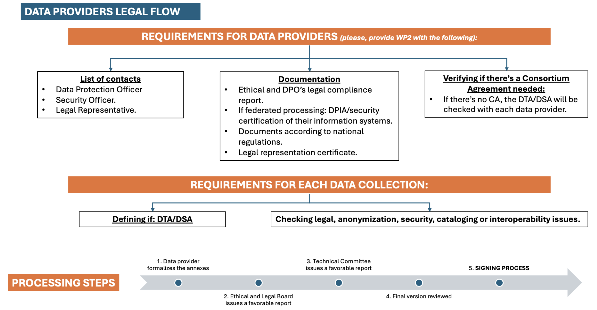

# 3\. Onboarding Process {#3.-onboarding-process}

EUCAIM defines a federated infrastructure in which nodes provide with data and services[^3].

## 3.1. Initial requirements and commitments {#3.1.-initial-requirements-and-commitments}

**Before you start, pre-onboarding workflow**:

1. If you are not an EUCAIM’s partner, and you are joining as a Stakeholder-Data Holder, please make sure you complete the **Expression of Interest** so we can have your organisation registered as Stakeholder: [EUCAIM Dashboard](https://dashboard.eucaim.cancerimage.eu/expression-of-interest)
2. **Register into the EUCAIM’s Dashboard** with a Life Science AAI (LS-AAI) account. Please follow these guidelines: [AAI in EUCAIM](https://docs.google.com/document/d/12fJwhPLqk1x6NIm9glGLd-kSCjA80maLIicT8AdLBBE/edit?tab=t.0)
3. If you are not on the **mailing list of Data Holders**, or if you want to make any subscription changes, please send a helpdesk ticket under the “First line support” category. If you do not have an account yet, you can use the helpdesk link [https://dashboard.eucaim.cancerimage.eu/helpdesk](https://dashboard.eucaim.cancerimage.eu/helpdesk). 
4. Kindly ensure that you **read the entire Handbook carefully**. This will also help you identify the appropriate channels for any questions, depending on the subject matter.
5. Please find also here a **glossary** with the most commonly used terms in the field of Health Data Research: [EUCAIM Glossary](https://eucaim.gitbook.io/glossary/)

**The summarized onboarding workflow for Data Holders includes:**
1. **Initial assessment**: retrieving all the Data Holders’ information through the:
  - __Application form__: [Call for use cases from EUCAIM partners](https://eu.jotform.com/233524103677050). Complete the application form for data incorporation use cases for the Access Committee. This will allow us to evaluate the scientific relevance of your participation in EUCAIM as a Data Holder.
  - __Tier’s Maturity Level Questionnaire__ (must be completed by all Data Holders): [TIER Maturity Level Questionnaire](https://dashboard.eucaim.cancerimage.eu/data-warehouse-maturity-questionnaire) This will allow us to assess the readiness and compliance of your provided datasets, categorizing them into three Tiers:
    - Tier 1: The datasets hosted by the federated node are registered in the central catalogue. Users can explore the metadata of the datasets registered in EUCAIM’s platform.
    - Tier 2: The data of the federated node is searchable through its local searching service, which is queried by the federated search system. The users can explore the actual number of studies fulfilling the search criteria defined by the user.
    - Tier 3: The federated node has a materialisation component that makes the data available to the federated processing, according to EUCAIM’s model. The user will be able to run processing actions on the actual data, if the access to them is granted.
 - __Data Warehouse Maturity Questionnaire:__ (must be completed just by the Real World Data Holders): [Data Warehouse Maturity Questionnaire](https://dashboard.eucaim.cancerimage.eu/data-warehouse-maturity-questionnaire) This will allow us to determine its preparedness and maturity to be part of a federated European data infrastructure for research by categorizing the centers into three CLUSTERS (1, 2 and 3).
2. **Selection of integration method**: data transfer to a Reference Node or local Federated Node setup. EUCAIM defines two ways of participating as data holders, each with unique capabilities and contributions in both research and clinical environments[^3] and defines a federated infrastructure in which nodes provide with data and services[^4]:
- **Data holders transferring data to a Reference Repository**. If you have completed research projects and aim to maintain your datasets for long-term research availability but need support, EUCAIM offers a solution. By contributing to one of our Reference Nodes, you will ensure that data remains accessible to other researchers. The process involves signing a Data Transfer Agreement (DTA) and sharing information about your project, metadata catalogue, and software. We will guide you through data de-identification, making your contribution hassle-free.
- **Federated Data Holders**: If you manage active repositories and want to maintain your datasets within a federated node, EUCAIM provides the platform. As a Federated Data Holder, you'll collaborate with us through a Data Sharing Agreement (DSA), and provide details about your research project, metadata catalogue, and software, along with information about your local computational and storage capabilities.
3. **Legal/Ethical/Technical compliance documentation:**
- GDPR-compliant documentation to be reviewed and approved by the institutional ethics committee.
- DTA/DSA signature + other documentation, please go to section 3.2 Legal Documents of this Handbook.
- Technical requirements: [Technical_requirements_Data_Holders](https://docs.google.com/document/d/1u0IPiPNcPivfECYzVvU6zXzh77jNrLojPeHIdLPjEhc/edit?usp=sharing)
4. Imaging and data preparation according to the EUCAIM Common Data Model and Hyperontology: https://eucaim.gitbook.io/eucaim-common-data-model/ 
Data transfer to the reference node vs data sharing by setting up a federated node.
5. Participation in monitoring, validation and quality assurance activities. Each step is supported by __tools, documentation, and expert teams__ from EUCAIM, ensuring Data Holders receive technical, legal, and procedural guidance throughout the process.

## 3.2. Legal documents. {#3.2.-legal-documents.}

This section summarises the legal documentation that is required to become a Data Holder in EUCAIM. This information is much more detailed (and potentially more up-to-date) in the Legal Handbook of the project, available in this [link](https://docs.google.com/document/d/1U-RpFycjXEVP-4-l9ppveT654x78Dhlw/edit). We recommend going through the Legal Handbook when requesting and preparing the information and use the information below as a general guidance.
A set of legal agreements must be prepared and signed to clearly state the obligations and responsibilities of the parties involved. The process is simpler in the case of Data Transfer Data Holders, as documents related to security and Service Level Agreements are provided by the reference nodes where the data will be deposited. Federated nodes have to provide a guarantee that they can fulfill the security and performance requirements[^5]. [Figure 3](#fig_legaldiagram) graphically shows the information and steps required for the legal framework of EUCAIM. 

 Figure 3: Information and steps required to complete the legal framework of EUCAIM.

It is essential that the data holder provides a contact person of its legal team to be in close communication with the legal team of EUCAIM. A contact point will be assigned during the onboarding process.

The first step will be to Complete the ethical training via the Moodle platform ([https://training.eucaim.cancerimage.eu/](https://training.eucaim.cancerimage.eu/))[^6]. Then, the ethical and legal requirements for data holders are different depending on the collaboration model chosen:

* **Data holders who agree to transfer data to a reference node**:

1. Proof of legal representation and legal basis in the case of data transfer involving multiple data holders (such as consortium or formal cooperation agreements).

2. The signature of the DTA with its annexes.

3. A copy of a favorable ethical approval (if applicable).

4. A report from the Data Protection Officer (DPO) confirming legal compliance (i.e., justification for data sharing).

5. Any documents required under your national legislation (e.g., authorization from a data protection authority, health authority, or any other relevant body)[^7]. 

6. State other restrictions that should be requested to data users. For example, there could be:  
   1. Prohibitions on commercial use of the data.  
   2. Restrictions due to intellectual property rights.  
   3. Restrictions on use depending on the conditions of the expression of consent by the data subject.

* **Data holders who want to set up their own federated node**:

1. Proof of legal representation and legal basis in the case of data sharing involving multiple data holders (e.g., consortium agreements, formal cooperation agreements, etc.).

2. The signature of the DSA with its annexes.

3. A copy of a favorable ethical approval (if applicable).

4. A report from the Data Protection Officer (DPO) confirming legal compliance (i.e., justification for data sharing).

5. Data Protection Impact Assessment (DPIA) and documents demonstrating the security of the information system. To demonstrate security tasks, some reference to international or national security standards like ISO 27001 will save time. Or results or a periodic external audit.

6. Any documents required under your national legislation (e.g., authorization from a data protection authority, health authority, or any other relevant body). 

7. Other restrictions. For example, there could be:

   1. Prohibitions on commercial use of the data.  
   2. Restrictions due to intellectual property rights.  
   3. Restrictions on use depending on the conditions of the expression of consent by the data subject.

In both cases it is compulsory that the DPO and/or the legal representative of the Data Holder confirm that they are aware about the transfer or sharing the data within EUCAIM and the security measures that must be taken. 

[Table 1](#tab_DTA-1) summarises the actions for the Data Holders opting for the Data Transfer model and [Table 2](#tab_DSA-1) for the Data Holders who will set up a federated node.

| Data Transfer |  |  |
| :---- | :---- | :---- |
| **Action** | **Description** | **Documents** |
| Provide documentation | Proof of legal representation and legal basis if necessary.  A copy of a favorable ethical approval (if applicable). A report from the DPO confirming legal compliance. Any documents required under your national legislation Terms of Usage for the data. | D4.4 [Final rules for participation report](https://drive.google.com/drive/folders/1dn1xQB9K7Fn3WzzqN5HRiQ7NiVwYt0yy)  (See Sections 4.4.1 (Legal requirements) and 4.4.2 (Ethical requirements for Data Holders) |
| Data Transfer Agreement | Fill-in and sign the DTA | [Draft DTA](https://drive.google.com/file/d/1F5zMFfhZ9u53gcMhxRNUZVivjqvLspkU/view?usp=sharing) |

[Table 1](#table_DTA-1): Summary of steps to be completed for Data Transfer case.

| Data Sharing |  |  |
| :---- | :---- | :---- |
| **Action** | **Description** | **Documents** |
| Provide documentation | Proof of legal representation and legal basis if necessary.  A report from the DPO confirming legal compliance. Data Protection Impact Assessment (DPIA)  Documents demonstrating the security of the information system. Any documents required under your national legislation. | D4.4 [Final rules for participation report](https://drive.google.com/drive/folders/1dn1xQB9K7Fn3WzzqN5HRiQ7NiVwYt0yy)  (See Sections 4.4.1 (Legal requirements) and 4.4.2 (Ethical requirements for Data Holders) |
| Data Sharing Agreement | Fill-in and sign the DSA | [Draft DSA](https://drive.google.com/file/d/1UMdDF52mXGHNIL0GegzfyuSBVfKCIl7d/view?usp=sharing) |
| Define especial Access Conditions | A Document to be signed by the Data User that indicates the conditions under the Data User can access the data. | [Draft Template](https://drive.google.com/file/d/1UMdDF52mXGHNIL0GegzfyuSBVfKCIl7d/view?usp=sharing) |
| Contact point for the negotiation (Only in federated nodes) | The LS-AAI details of the data holder delegate who will interact with the Data User through the negotiator. | [Registration of users in EUCAIM](https://drive.google.com/file/d/1EsFYxbzqpyYKggyeKrKKw3FkVecDby8P/view) LS-AAI.  |

[Table 2](#table_DSA-1): Summary of steps to be completed for Data Sharing case

[^3]:  *See [D5.6 Minimum Data Federation and Interoperability Framework](https://drive.google.com/file/d/1URY8jtofLQpokTh7Hzag2wFFV9r1d_fs/view?usp=sharing)* *section 3 and [https://eucaim.gitbook.io/architecture-of-eucaim/4.-detailed-architecture](https://eucaim.gitbook.io/architecture-of-eucaim/4.-detailed-architecture)* 

[^4]:  *See ​​Deliverable [D4.4 Rules for Participation](https://drive.google.com/file/d/1QCAbv5nPpykos16-hmtKxFmb1h7YxP9B/view?usp=sharing), section 4.3.1 (Data Transfer) and 4.3.2 (Data Sharing)., Sections 4–6*.

[^5]:  *See D4.4 [Final rules for participation report](https://drive.google.com/drive/folders/1dn1xQB9K7Fn3WzzqN5HRiQ7NiVwYt0yy) , Sections 4.1 and 4.4, D5.6 [Minimum Data Federation and Interoperability Framework](https://drive.google.com/drive/folders/1mzMxUBdah2a-Wm4jNJHqhDmB-ZSDCT_u), Section 3 (Federation Architecture and Agreements)\]*

[^6]:  *See D2.4 [Training Evaluation: Guidelines, Best Practices, Lessons Learned](https://drive.google.com/file/d/1hNCkrP8UutNiPexzAzpsdt3WDOwdVh66/view?usp=drive_link).*

[^7]:  See  D4.4 [Final rules for participation report](https://drive.google.com/drive/folders/1dn1xQB9K7Fn3WzzqN5HRiQ7NiVwYt0yy), Sections 4.4.1 (Legal requirements) and 4.4.2 (Ethical requirements for Data Holders).
