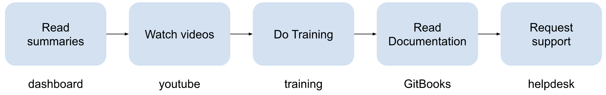

# 4\. Support and communication  {#4.-support-and-communication}

## 4.1. Engagement Team {#4.1.-engagement-team}

As the first line of support for Data Holders, the **Engagement Team** will reach out to them to start the Onboarding process to the EUCAIM Federation. 
- The __Engagement Team Coordinator__ will focus on coordinating the relationships with the Data Holders by providing them with the information and resources that will guide them through each step of the onboarding process as well as collecting information from their centre’s current situation. 
- Each DH’s DPO will be contacted by the __Engagement Team’s legal support team__ directly to address the legal requirements.
DH’s will also be assigned with one of the __Engagement Team’s technicians__ that will support them in any technical matter, but this will be mainly addressed also via the  - Helpdesk which will be explained as follows.

## 4.2. Helpdesk {#4.2.-helpdesk}

The information on the usage of the platform is available in different sources:

- The dashboard profile pages for general awareness of the platform functionality and purpose, as well as of the user profiles

- The GitBooks of the EUCAIM platform, where usage of the services is detailed. 

- The Youtube channel, with videos and tutorials.

- The Training platform, with courses for the different user profiles 

- The HelpDesk, for requesting support when facing issues or when direct interaction is required (e.g. for requesting the uploading data, registering a dataset, etc.).

 Figure 4: Sources of information for Data Holders

| Support source | Purpose | Link (s) |
| :---- | :---- | :---- |
| Dashboard profile pages | Get general awareness of the platform functionality and purpose, and the user profiles.  | [https://dashboard.eucaim.cancerimage.eu](https://dashboard.eucaim.cancerimage.eu)  |
| Dashboard GitBook | Brief description of the components and functionality available from the Dashboard.  | [https://eucaim.gitbook.io/eucaim-dashboard](https://eucaim.gitbook.io/eucaim-dashboard) |
| End User Guide GitBook | Information on how to use the platform being a Data User, Data holder or SW provider. | [https://eucaim.gitbook.io/end-user-guide](https://eucaim.gitbook.io/end-user-guide)  |
| Architecture GitBook | Details on the architecture, software dependencies, protocols and interactions of the components in EUCAIM.  | [https://eucaim.gitbook.io/architecture-of-eucaim](https://eucaim.gitbook.io/architecture-of-eucaim)  |
| YouTube Channel | Videos with interviews and demonstrations. | [https://www.youtube.com/@EUCAIM](https://www.youtube.com/@EUCAIM)  |
| Training Platform | Provides access to comprehensive training materials that facilitate usage of the platform for data holders, data users and software providers. | [https://training.eucaim.cancerimage.eu/](https://training.eucaim.cancerimage.eu/)  |
| Helpdesk | When you face an issue you can submit a ticket to the Help Desk. Additionally, actions that require interaction with the user are encouraged to be done through the helpdesk. | [https://help.cancerimage.eu](https://help.cancerimage.eu)  |

[Table 3](#table_document): Sources of documentation and support in EUCAIM

You may contact the Helpdesk via two paths:

- **If you have a Life Science AAI account** : Access to the Helpdesk user interface on [https://help.cancerimage.eu/](https://help.cancerimage.eu/) by authenticating using your Life Science AAI account. There, you may create a ticket describing the issue, assign it to the dedicated support team, and follow its status.

- **If you do not have a Life Science AAI account** : Access to the Helpdesk from the [EUCAIM dashboard](https://dashboard.eucaim.cancerimage.eu/) via a webform, under the “Helpdesk” menu. You will be requested to provide your contact information in the webform, in order to receive assistance. Once the form is submitted, it will automatically create a ticket in the Helpdesk instance, where the Technical support unit will be able to access the request and address it.

The issue will be addressed within 48 hours, and the data holder will receive an answer by email as well as in the helpdesk interface.

### **4.3. EUCAIM training platform: Overview of courses and access**  {#4.1.1.-eucaim-training-platform:-overview-of-courses-and-access}

Figure 5: Schema of the training modules
