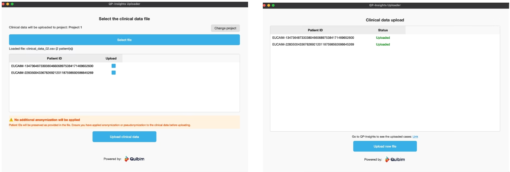

# 6. Option 1: Transfer to Reference Node

## 6.1. Reference Nodes

EUCAIM has set up two reference nodes to host data transferred from the data holders. These two reference nodes are complementary and use compatible but different technologies.

* The UPV node ([https://eucaim-node.i3m.upv.es/](https://eucaim-node.i3m.upv.es/)) uses an open-source platform developed in the CHAIMELEON project ([https://github.com/chaimeleon-eu](https://github.com/chaimeleon-eu)) for providing a fully integrated Data Lake, a Registry and a Virtual Research Environment powered by 10 dedicated physical nodes, with a total of 960 cores, 7,5TB of RAM and 25 NVIDIA GPUs with 24GB RAM each. The data ingestion component and the DICOM viewer of this node is QP-Insights (from [QUIBIM](https://quibim.ai/)), which supports the upload of DICOM studies and associated clinical data in CSV or XLS formats via a REST API (compatible with DICOM-Web API).
* The Euro-BioImaging Medical Imaging Repository ([https://xnat.health-ri.nl](https://xnat.health-ri.nl)) is a platform operated by Health-RI ([https://www.health-ri.nl/en/services/xnat](https://www.health-ri.nl/en/services/xnat)) for storing and managing imaging provided as a service through the Euro-BioImaging ERIC. XNAT is an extensible open-source imaging platform that simplifies common tasks in imaging data management. The Imaging Data should be stored in DICOM format if that is available, but can be also stored in other formats like NIfTI, and derived data and clinical data can also be stored in appropriate file formats (CSV or JSON).

Details on the features supported by each Reference node are provided in [D5.6](https://cancerimage.eu/wp-content/uploads/2026/02/D5.6.-Minimum-Data-Federation-and-Interoperability-Framework.pdf), section 4.3.3. 
All communications are performed using encrypted protocols (TLS 1.3).

## 6.2. Transferring data to the nodes

The workflow for uploading the datasets is presented in [Figure 10](Transfer.md#fig_dataing1) and described in the next sections.

### &#x20;

### 6.2.1. Initial steps

**Steps 1 to 4** are described in the previous chapter [5. Data Preparation process](DataPreparation.md).
But in case of HealthRI Reference Node the anonymisation of the imaging data will be done by CTP, the upload tool, in step 8.

**Step 5.** Request a user account and permissions:
 - First you should register in EUCAIM if you still haven't done, see [the guide](https://drive.google.com/file/d/1EsFYxbzqpyYKggyeKrKKw3FkVecDby8P/view).
 - Then register in the Reference Node where you are going to transfer the data:
   | UPV   | HealthRI         |
   | :---- | :--------------- |
   | Please go to the [main page](https://eucaim-node.i3m.upv.es/), login button, register through LS-AAI and select the “Data Ingester” role. | [Registration of users in HealthRI](https://www.health-ri.nl/en/services/xnat) |

**Step 6.** Provide Data Ingester Account Details:
Open a ticket in [https://help.cancerimage.eu](https://help.cancerimage.eu), select the corresponding group (“UPV Reference nodes” or “Health-RI Reference node”) and add a request with the title: "Create a new project" and providing a name for the project, the username in EUCAIM who will manage it and an URL of provider organisation if there is any. An answer will be given soon.

**Step 7.** Download and install the Data Ingestion tool depending on the destination reference node:
| UPV   | HealthRI         |
| :---- | :--------------- |
| The details for downloading and installing the tool are available in [https://bio.tools/qp-insights\_uploader](https://bio.tools/qp-insights_uploader) . In case of trouble, you can request an issue in the helpdesk in the same category as above.  | The data ingestion tool for imaging is the Clinical Trial Processor (CTP). The standalone version can be downloaded here: [https://gitlab.com/radiology/infrastructure/data-curation-tools/ctp-standalone](https://gitlab.com/radiology/infrastructure/data-curation-tools/ctp-standalone). |

> ⚠️ Attention! Please, do not proceed with the metadata release until you are declared legally compliant by your correspondent EUCAIM legal team member after providing all the requirements and the DTA/DSA has been signed by both the legal representative of your institution and EUCAIM’s Scientific Director (Dr. Luís Martí). 

**Next steps.** 
The next steps depends on the reference node used to transfer
| UPV   | HealthRI         |
| :---- | :--------------- |
| [6.2.2. Data Transfer to the UPV reference node using QP-Insights](#622-data-transfer-to-the-upv-reference-node-using-qp-insights) | [6.2.3. Data Transfer to the HealthRI reference node](#623-data-transfer-to-the-healthri-reference-node) |

Regardless of the reference node used to transfer please don't forget to publish the datasets at the end in the Federated Catalogue: the process is described in the last section [6.3. Publishing datasets in the Federated Catalogue](#63-publishing-datasets-in-the-federated-catalogue).

### 6.2.2. Data Transfer to the UPV reference node using QP-Insights
QP-Insigths supports the ingestion of DICOM Images and associated clinical data to the UPV reference node using two pathways: 

-	**Batch upload via QP-Insights Uploader App**. Recommended for retrospective or large-scale repositories as this method enables the simultaneous transfer of multiple studies.    
-	**Manual upload via QP-Insights Web Interface**. This is a case-by-case upload, ideal for observational studies where individual case handling is prefered. 

**Important**: Before uploading any data, an administrator must **manually create a new project**, if you don't see your project go back to the step 7. 

#### 6.2.2.1. Batch upload via QP-Insights Uploader (Desktop App)
The [QP-Insights Uploader](https://bio.tools/qp-insights_uploader) is specially designed to upload many studies in batch. It is recommended to upload a small batch first in order to check that the uploaded data is the expected, and if everything is ok, then upload the rest. 

Once the application is executed, you will have to log in using your **UPV reference node credentials**. If you previously accessed the platform using LS-AAI, you may need to manually set up a password. You can do this under:

 [Main page](https://eucaim-node.i3m.upv.es) -> User Account -> Account security -> Signing in -> Add a password. 
 
 Once logged in, select the type of data you intend to upload first: imaging or clinical. 

**Upload of images** 

After selecting **upload of image data**, choose the project and timepoint for your upload in the dropdown menu. Timepoints (e.g. Diagnosis, follow-up...) are defined during the project creation and are associated to a given project. Then, select the folder that contains the images that you want to upload to the project by clicking "Select folder". 

The application will scan all patients, studies, and series present in the selected folder. Select the items you want to upload and start the process. The upload status updates dynamically. When complete, each item will be marked as uploaded or uploaded with errors. If an error occurs, a downloadable file describing the issue will be automatically generated. 

**Upload of clinical data** 

Once medical imaging data is uploaded, you can proceed with the clinical data. 

NOTE: if you decide to convert the data through the **ETL** application inside the node you will be able to upload the clinical data directly to the ETL desktop.

After selecting **upload of clinical data** select the target project. Then, upload the file containing the clinical data. Both Excel and CSV formats are supported. Please ensure that **the first column is labeled PatientID** and the values in this column **match the DICOM PatientID tag** (0010, 0020) of your image data. This will ensure your clinical data is correctly linked to the image data. As with image uploads, any errors will generate a downloadable tabular report. 

**Accessing Uploaded Data** 

Once uploaded, the exams can be accessed through the QP-Insights platform at: https://qpinsights.eucaim-node.i3m.upv.es/cases/subjects. Uploaded images can be viewed using the integrated **DICOM Viewer**. The DICOM Viewer **supports the annotation of data** in the reference node, offering tools to extract ROI measurements and generate segmentation masks. Annotations can be created **manually from scratch or semi-automatically**. In the latter case, AI tools can be executed to produce preliminary annotations that clinicians can then refine and correct, thereby accelerating the annotation workflow. 

#### 6.2.2.2. Case-by-case upload via QP-Insights Web Interface

To upload data using the web interface (no installation required), access https://qpinsights.eucaim-node.i3m.upv.es/cases. 

To begin importing a new imaging exam, click the “Import exam” icon located in the upper-right corner of the workspace.

You will be prompted to select the project in which you want to upload the exam. Next, choose the subject from the drop-down list.
If the subject does not yet exist, type the desired subject name. A button will appear to the right of the search field allowing you to create the new subject when no match is found.
After that, select the appropriate timepoint from the drop-down menu.

To add imaging data, click inside the upload box to browse for your DICOM files or drag and drop them directly into the window.
Once selected, the interface will display the list of exams identified in the upload. All series are automatically checked for upload, but you may deselect any series you do not wish to include by unticking the corresponding boxes in the "Included" column.

During the upload, you will see live progress updates. When the process completes, a summary of the import results will appear. Select “Go to Cases” to close the summary and return to the Cases view.

If your project includes an electronic Case Report Form (eCRF), you can fill it out manually for each subject. Open the eCRF by clicking the file icon in the Cases view. An eCRF template must be uploaded for the project beforehand. The form will then be displayed and can be completed directly within the interface.

Additionally, the QP-Insights application includes a set of DICOMWeb standards-based functionalities for working with DICOM files via API.

#### 6.2.2.3. Creating the dataset
Datasets uploaded to UPV reference node won’t be immediately published, it is necessary first to create a dedicated dataset from the data that was uploaded to the platform. QP-Insights implements a dedicated workflow to create datasets from the data previously uploaded to the platform. The user with the role of *dataset manager* will be able to select subjects or cases of a project. When one o more cases are selected, the button "Export dataset" appears in the bottom right corner to allow the dataset creation. In the next page, the user will be asked for a name, description and purpose, along with the dataset type and method as shown in Figure 6.12. The dataset creation will later be reflected in the dataset explorer. 

#### 6.2.2.4. Upload metadata
The description of this user action refers to the release of a dataset as a discoverable one. This implies two steps:

1. **Release the dataset** in the catalogue of the node. To do it you have to access the [dataset explorer](https://eucaim-node.i3m.upv.es/dataset-service), look for the dataset (initially with the flag "draft", only visible to you) and enter the details page (Figure 6.13). Here verify that the draft of dataset is correct, review all the properties, ensure all of them are filled in, including the contact information and license. Optionally you can even create a Virtual Research Environment if you have the "datascientist" role to explore and check de contents (detailed in [section 4.8 of the user guide](https://eucaim.gitbook.io/enduserguide/4-userguideforresearchers#id-4.8.-reference-node-at-upv)). Then you can "release" the dataset, there is an option for that in the "Actions" button.

2. **Register the dataset in the EUCAIM's catalogue**. This final step is described in the last section [6.3. Publishing datasets in the Federated Catalogue](#63-publishing-datasets-in-the-federated-catalogue).

#### 6.2.2.5. Dataset tracing (additional note)
The operations of creation, access and batch processing to a specific dataset are registered on a Blockchain Database. This database is operated by the Tracer Service in the UPV reference node, logging any action performed on the datasets hosted.  
The information on the access history is available through the dataset details page in the UPV reference node [dataset explorer](https://eucaim-node.i3m.upv.es/dataset-service).

*Info for developers*: The Tracer Service has a REST API for any other service to register additional actions.  
The list of traces can be queried for a specific dataset using the GET operation on the endpoint [https://eucaim-node.i3m.upv.es/tracer-service/tracer/api/v1/traces?datasetId=dataset-id](https://eucaim-node.i3m.upv.es/tracer-service/tracer/api/v1/traces?datasetId=dataset-id), provided that the user has the proper credentials.

### 6.2.3. Data Transfer to the HealthRI reference node
Please make sure you fulfill the requisites before continuing with uploading your data to the [Health-RI XNAT](https://xnat.health-ri.nl)

#### 6.2.3.1. Uploading Dicom data

##### Data requirements
Please make sure the DICOM files are de-identified and contain properly formatted headers.

At a minimum, the following headers need to be present:
| Attribute                            | DICOM Tag   | Requirement | Example  |
| ------------------------------------ | ----------- | ----------- | -------- |
| Patient ID                           | (0010,0020) | Mandatory   | X123456  |
| Image modality                       | (0008,0060) | Mandatory   | CT       |
| Image body part                      | (0018,0015) | Mandatory   | Chest    |
| Image manufacturer                   | (0008,0070) | Mandatory   | Siemens  |
| Data of image acquisition (YYYYMMDD) | (0008,0022) | Mandatory   | 20241230 |

For uploading dicom data using CTP is recommended. Please use [🔗 this guide](https://gitlab.com/radiology/infrastructure/data-curation-tools/ctp-standalone/-/raw/main/Manuals/EUCAIM%20XNAT%20Central%20Repository.pdf) to upload your data.

#### 6.2.3.2. Uploading Nifti data

##### Data requirements
When uploading nifti's you need to supply required dicom headers in json format. Follow the [🔗 DICOM specifications for formatting this json](https://dicom.nema.org/medical/dicom/current/output/chtml/part18/chapter_F.html) file. [🔗 This is an example](https://dicom.nema.org/medical/dicom/current/output/chtml/part18/sect_F.4.html) on how such a file should be formatted.

##### Uploading

Here is an example how to upload nifti files: https://gitlab.com/radiology/infrastructure/xnatpy/-/blob/master/examples/upload_nifti.py

Here is an example how to upload the dicom json files: https://gitlab.com/radiology/infrastructure/xnatpy/-/snippets/4831410

See detailed instructions on how to use the Clinical Trial Processor (CTP) in this [guide](https://gitlab.com/radiology/infrastructure/data-curation-tools/ctp-standalone/-/raw/main/Manuals/EUCAIM%20XNAT%20Central%20Repository.pdf).

#### 6.2.3.3. Uploading the clinical data

Once medical imaging data is uploaded, you can proceed with the clinical data. [XNATpy](https://xnat.readthedocs.io/en/latest/) can be used to upload the CSV or JSON to XNAT.

#### 6.2.3.4. Create and Publish the Dataset

The project in XNAT should be set to protected (or public) to make the metadata visible.

## 6.3. Publishing datasets in the Federated Catalogue

This is required for all datasets, including those in Tier 1. 
The process of registration will be automated but it is manual for the current time being.

The dataset schema can be downloaded from this [link](https://docs.google.com/spreadsheets/d/1cj6YzIAchHnEKlH612gO91WzHfEOB4TbwBrl9a0kgE0/edit?usp=sharing). 
In case of doubts with the terminology, use textual descriptions. It is very important that the Identifier matches the id that the federated search will provide for this dataset, as it is the only field that cannot be changed afterwards. For example, in Figure 6.13 the id would be `c75d0998-85db-4c94-9d2c-346961f0c6f7`.

Once you have filled in all the information, create a ticket on the [helpdesk](https://help.cancerimage.eu/) under the group "catalogue", providing the spreadsheet file with the metadata information. The helpdesk team will contact you back informing if the dataset has been properly registered or requesting more information. 

Once it is created, please access the registry in the catalogue, locate your dataset and verify the details: 
[https://catalogue.eucaim.cancerimage.eu/](https://catalogue.eucaim.cancerimage.eu/).  

**Final steps in UPV reference node**
 - The flag "Published" will be added to the dataset in the catalogue of the node and so it will be included in the [EUCAIM UPV Reference node community in Zenodo](https://zenodo.org/communities/eucaim-upv-node-datasets/records?q=&l=list&p=1&s=10&sort=newest) acquiring a DOI.  
 - The tag "eucaim-indexed" will be added to the dataset to make it discoverable through the Federated Search (required for Tier 2 and above).

