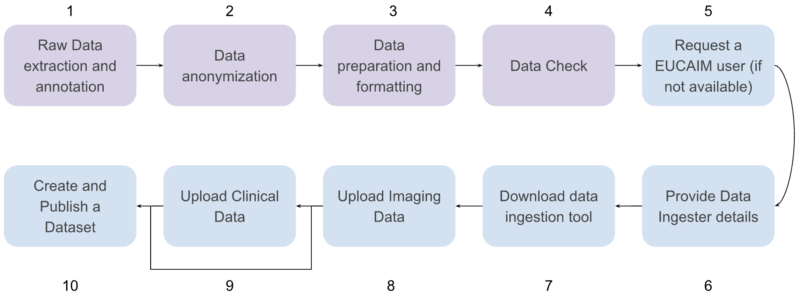

# 6\. Option 1: Transfer to Reference Node {#6.-option-1:-transfer-to-reference-node}

## 6.1. Reference Nodes {#6.1.-reference-nodes}

EUCAIM has set up two reference nodes to host data transferred from the data holders. These two reference nodes are complementary and use compatible but different technologies.

- The UPV node ([https://eucaim-node.i3m.upv.es/](https://eucaim-node.i3m.upv.es/)) uses an open-source platform developed in the CHAIMELEON project ([https://github.com/chaimeleon-eu](https://github.com/chaimeleon-eu)) for providing a fully integrated Data Lake, a Registry and a Virtual Research Environment powered by 10 dedicated physical nodes, with a total of 960 cores, 7,5TB of RAM and 25 NVIDIA GPUs with 24GB RAM each. The data ingestion component and the DICOM viewer of this node is QUIBIM QP-Insights platform, which supports the upload of DICOM studies via a DICOMWeb API (DICOMweb) and a REST API to upload the clinical data in JSON files.

- The Euro-BioImaging Medical Imaging Repository ([https://xnat.health-ri.nl](https://xnat.health-ri.nl)) is a platform operated by Health-RI ([https://www.health-ri.nl/en/services/xnat](https://www.health-ri.nl/en/services/xnat)) for storing and managing imaging provided as a service through the Euro-BioImaging ERIC. XNAT is an extensible open-source imaging platform that simplifies common tasks in imaging data management. The Imaging Data should be stored in DICOM format if that is available, but can be also stored in other formats like NIfTI, and derived data and clinical data can also be stored in appropriate file formats (CSV or JSON).

Details on the features supported by each Reference node are provided in D5.6, section 4.3.3. All communications are performed using encrypted protocols (TLS 1.3).

## 6.2. Transferring data to the nodes {#6.2.-transferring-data-to-the-nodes}

The workflow for uploading the datasets is described in [figure 9](#fig_dataing1). [Table 5](#tab_6REFUPV) and [Table 6](#tab_6REFHRI) describe the individual steps required to fulfil the process for each one of the reference nodes.

 
Figure9: Steps in the process of transferring data to the nodes. Steps in purple are covered in section 5\. Steps in blue (5-10) are described in tables [Table 5](#tab_6REFUPV) and [Table 6](#tab_6REFHRI).

| \# | Action | Documentation / Links |
| :---- | :---- | :---- |
| 5 | Request a EUCAIM User | [Registration of users in EUCAIM](https://drive.google.com/file/d/1EsFYxbzqpyYKggyeKrKKw3FkVecDby8P/view) [Registration of users in eucaim-node](https://eucaim-node.i3m.upv.es/dataset-service/datasets?invalidated=false), login button, register through LS-AAI and ask for a “Data Ingester” account. |
| 6 | Provide Data Ingester Account Details | Open a ticket in [https://help.cancerimage.eu](https://help.cancerimage.eu), select the “Reference nodes” group (or “Technical support team” if unavailable) and add a request with the title: “Create a data ingestion imaging biobank” and providing a name for the biobank, the username in EUCAIM who will manage it (step \#4) and an URL if available. An answer will be given soon.  |
| 7 | Download and install the Data Ingestion tool | The data ingestion tool is a Python web applications. In case of trouble, you can request an issue in the helpdesk in the same category as above. The details for downloading and installing the tool are available in [https://bio.tools/data\_ingestion\_tool\_upv\_reference\_node](https://bio.tools/data_ingestion_tool_upv_reference_node) . |
| 8 | Upload Imaging Data  | The instructions for using the tool are available in the User Guide for Data Holders ([https://eucaim.gitbook.io/end-user-guide/user-guide-for-data-holders](https://eucaim.gitbook.io/end-user-guide/user-guide-for-data-holders)). Proceed initially uploading medical imaging data. |
| 9 | Upload clinical Data  | Once medical imaging data is uploaded, you can proceed with the clinical data. If you decide to convert the data through the [ETL](https://www.google.com/url?q=https://bio.tools/eetl_toolset&sa=D&source=docs&ust=1746522946004469&usg=AOvVaw03nEW7Q5sOpFaDNIZA6ogQ) inside the node and this process is expected to be long, we encourage you to create an “image-only” dataset by skipping this step.  |
| 10 | Create and Publish the Dataset | The creation of a dataset is described in section 6.2.2.3  of the the User Guide for Data Holders ([https://eucaim.gitbook.io/end-user-guide/user-guide-for-data-holders](https://eucaim.gitbook.io/end-user-guide/user-guide-for-data-holders)). Once the dataset is created, additional metadata of the dataset can be added and the dataset published as described in 6.2.3.4 of the same document.  The user can “release” the dataset and then it will be validated by the responsible of the platform. Once it is validated, the dataset will be published. Publishing a dataset only exposes the aggregated metadata and no individual data is released. |

[Table 5](#table_6REFUPV): Uploading data in the UPV reference node. Steps 1 to 4 are described in section 5\.

| \# | Action | Documentation / Links |
| :---- | :---- | :---- |
| 4 | Anonymisation | Anonymisation of the imaging data will be done step 7 during sending.   |
| 5 | Request a EUCAIM User | [Registration of users in EUCAIM](https://drive.google.com/file/d/1EsFYxbzqpyYKggyeKrKKw3FkVecDby8P/view) |
| 6 | Provide Data Ingester Account Details | Open a ticket in [https://help.cancerimage.eu](https://help.cancerimage.eu), select the “Reference nodes” group (or “Technical support team” if unavailable) and add a request with the title: “Create XNAT project” and providing the name of the project, the username in EUCAIM who will manage it (step \#4) and an URL if available. An answer will be given soon.  |
| 7 | Download and install CTP | The data ingestion tool for imaging is the Clinical Trial Processor (CTP). The standalone version can be downloaded here: [https://gitlab.com/radiology/infrastructure/data-curation-tools/ctp-standalone](https://gitlab.com/radiology/infrastructure/data-curation-tools/ctp-standalone).  |
| 8 | Upload Imaging Data  | Upload the imaging data using CTP, see manual here: [https://gitlab.com/radiology/infrastructure/data-curation-tools/ctp-standalone/-/blob/a195e33ff9711da8e5abefc8285c443b40b8502a/Manuals/EUCAIM%20XNAT%20Central%20Repository.pdf](https://gitlab.com/radiology/infrastructure/data-curation-tools/ctp-standalone/-/blob/a195e33ff9711da8e5abefc8285c443b40b8502a/Manuals/EUCAIM%20XNAT%20Central%20Repository.pdf)  |
| 9 | Upload clinical Data  | Once medical imaging data is uploaded, you can proceed with the clinical data. [XNATpy](https://xnat.readthedocs.io/en/latest/) can be used to upload the CSV or JSON to XNAT.  |
| 10 | Create and Publish the Dataset | The project in XNAT should be set to protected (or public) to make the metadata visible.  |

[Table 6](#table_6REFHRI): Uploading data in the Health-RI reference node. Steps 1 to 3 are described in section 5\.
